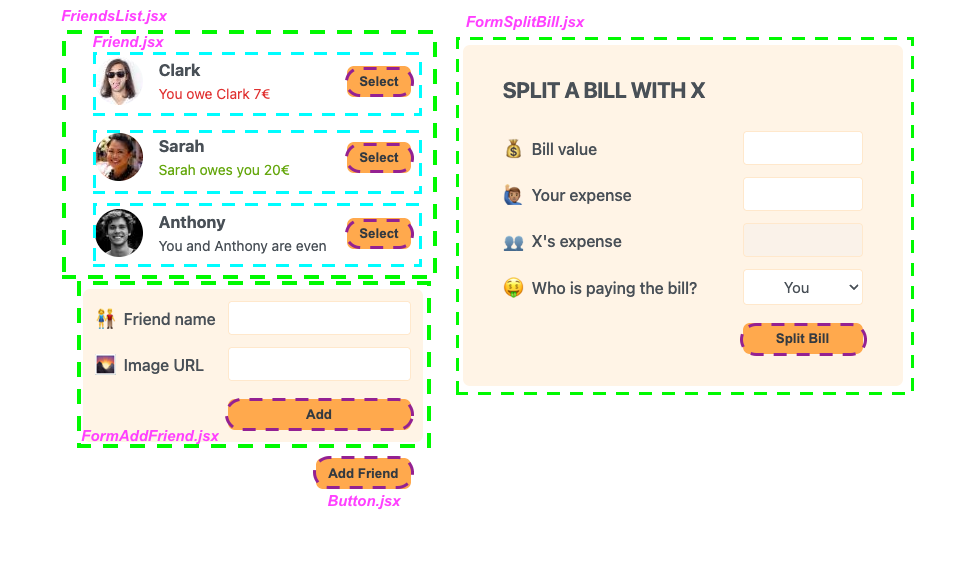
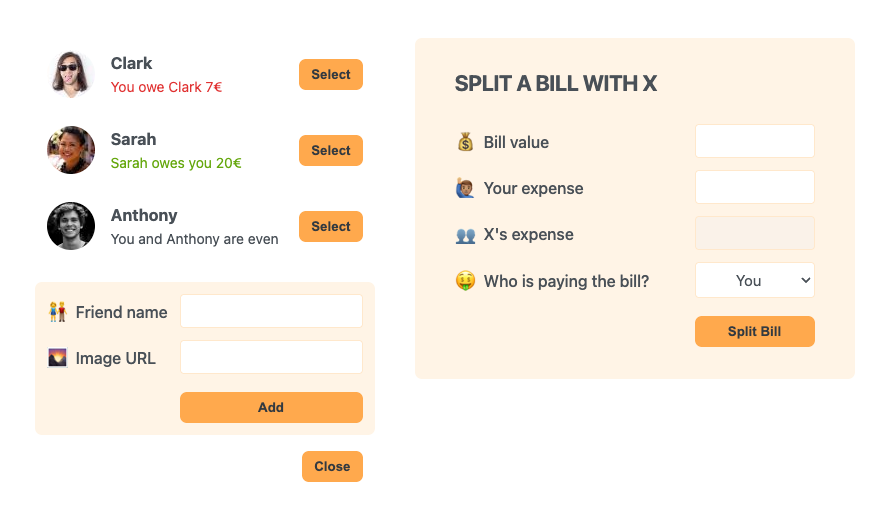
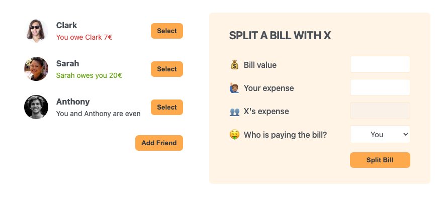
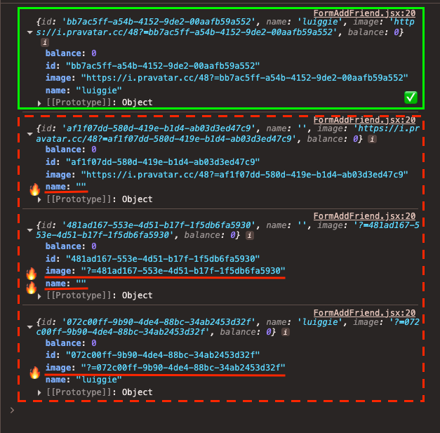
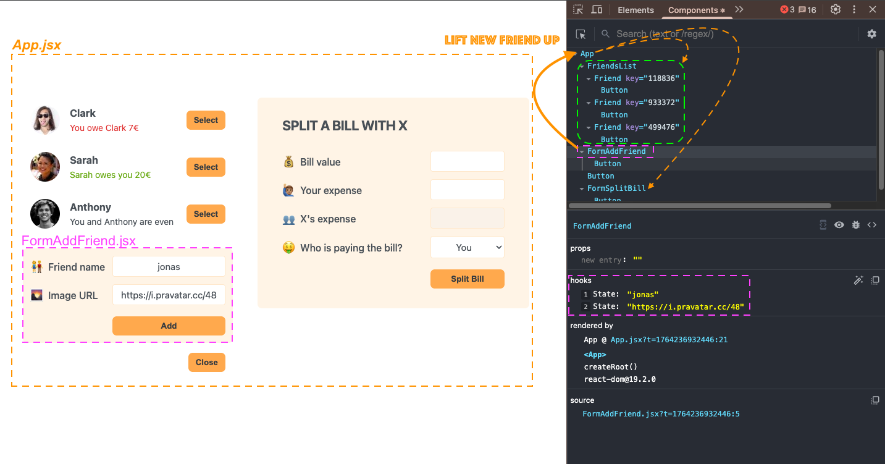

# 🧑🏾‍💻 Section 08: Practice Project: Eat-'N-Split

## 📚 Lecture 096: Building the Static App: List of Friends

### 1. **`App`** component:
```jsx
/* src/App.jsx */
import FriendsList from "./components/FriendsList";
function App() {
  return (
    <div className="app">
      <div className="sidebar">
        <FriendsList />
      </div>
    </div>
  );
}
export default App;
```


### 2. **`FriendsList`** component:
```jsx
/* src/components/FriendsList.jsx */
import Friend from "./Friend";
const initialFriends = [
  {
    id: 118836,
    name: "Clark",
    image: "https://i.pravatar.cc/48?u=118836",
    balance: -7,
  },
  {
    id: 933372,
    name: "Sarah",
    image: "https://i.pravatar.cc/48?u=933372",
    balance: 20,
  },
  {
    id: 499476,
    name: "Anthony",
    image: "https://i.pravatar.cc/48?u=499476",
    balance: 0,
  },
];
const friends = initialFriends;
const FriendsList = () => {
  return (
    <ul>
      {friends.map((friend) => (
        <Friend key={friend.id} friend={friend} />
      ))}
    </ul>
  );
};
export default FriendsList;
```

### 3. **`Friend`** component:
```jsx
/* src/components/Friend.jsx */
const Friend = ({ friend }) => {
  return (
    <li>
      
      <h3>{friend.name}</h3>
      {friend.balance < 0 && (
        <p className="red">
          You owe {friend.name} {Math.abs(friend.balance)}€
        </p>
      )}
      {friend.balance > 0 && (
        <p className="green">
          {friend.name} owes you {Math.abs(friend.balance)}€
        </p>
      )}
      {friend.balance === 0 && <p>You and {friend.name} are even</p>}
      <button className="button">Select</button>
    </li>
  );
};
export default Friend;
```

## 📚 Lecture 097: Building the Static App: Forms

### 1. Create **`Button`** component:
```jsx
/* src/common/Button.jsx */
const Button = ({ children }) => {
  return <button className="button">{children}</button>;
};
export default Button;
```

### 2. Create **`FormAddFriend`** component:
```jsx
/* src/components/FormAddFriend.jsx */
import Button from "../common/Button";
const FormAddFriend = () => {
  return (
    <form className="form-add-friend">
      <label>👫 Friend name</label>
      <input type="text" />

      <label>🌄 Image URL</label>
      <input type="text" />
      <Button>Add</Button>
    </form>
  );
};
export default FormAddFriend;
```

### 3. Add `FormAddFriend` & `Button` for "Add Friend" components into  **`App.jsx`**
```jsx
/* src/App.jsx */
import FriendsList from "./components/FriendsList";
import FormAddFriend from "./components/FormAddFriend";
import Button from "./common/Button";
function App() {
  return (
    <div className="app">
      <div className="sidebar">
        <FriendsList />
        <FormAddFriend />
        <Button>Add Friend</Button>
      </div>
    </div>
  );
}

export default App;
```


### 4. Create **`FormSplitBill`** component:
```jsx
/* src/components/FormSplitBill.jsx */
import Button from "../common/Button";
const FormSplitBill = () => {
  return (
    <form className="form-split-bill">
      <h2>Split a bill with X</h2>

      <label>💰 Bill value</label>
      <input type="text" />

      <label>🙋🏽‍♂️ Your expense</label>
      <input type="text" />

      <label>👥 X's expense</label>
      <input type="text" disabled />

      <label>🤑 Who is paying the bill?</label>
      <select>
        <option value="user">You</option>
        <option value="friend">X</option>
      </select>

      <Button>Split Bill</Button>
    </form>
  );
};
export default FormSplitBill;
```

### 5. Import **`FormSplitBill`** to **`App`**:
```jsx
/* src/App.jsx */
import FriendsList from "./components/FriendsList";
import FormAddFriend from "./components/FormAddFriend";
import Button from "./common/Button";
import FormSplitBill from "./components/FormSplitBill";
function App() {
  return (
    <div className="app">
      <div className="sidebar">
        <FriendsList />
        <FormAddFriend />
        <Button>Add Friend</Button>
      </div>
      <FormSplitBill />
    </div>
  );
}
export default App;
```

### 6. Static App:



## 📚 Lecture 098: Displaying the New Friend Form

### 1. Add a state variable in **`App.jsx`** component:
```jsx
/* src/App.jsx */
import FriendsList from "./components/FriendsList";
import FormAddFriend from "./components/FormAddFriend";
import Button from "./common/Button";
import FormSplitBill from "./components/FormSplitBill";
import { useState } from "react";  // 👈🏽 ✅
function App() {
  const [showAddFriend, setShowAddFriend] = useState(true);  // 👈🏽 ✅
  return (
    <div className="app">
      <div className="sidebar">
        <FriendsList />
        {showAddFriend && <FormAddFriend />}  // 👈🏽 ✅
        <Button>{showAddFriend ? "Close" : "Add Friend"}</Button>  // 👈🏽 ✅
      </div>
      <FormSplitBill />
    </div>
  );
}
export default App;
```

### 2. Add **`onClick()`** function as prop in **`Button`** component:
```jsx
/* src/common/Button.jsx */
const Button = ({ children, onClick }) => {  // 👈🏽 ✅
  return (
    <button className="button" onClick={onClick}>  // 👈🏽 ✅
      {children}
    </button>
  );
};
export default Button;
```

### 3. Apply this **`onClick`** function prop from **`App`** creating **`handleShowAddFriend`** function:
```jsx
/* src/App.jsx */
import FriendsList from "./components/FriendsList";
import FormAddFriend from "./components/FormAddFriend";
import Button from "./common/Button";
import FormSplitBill from "./components/FormSplitBill";
import { useState } from "react";
function App() {
  const [showAddFriend, setShowAddFriend] = useState(true);
  const handleShowAddFriend = () => {  // 👈🏽 ✅
    setShowAddFriend(!showAddFriend);
  };
  return (
    <div className="app">
      <div className="sidebar">
        <FriendsList />
        {showAddFriend && <FormAddFriend />}
        <Button onClick={handleShowAddFriend}>{showAddFriend ? "Close" : "Add Friend"}</Button>  // 👈🏽 ✅
      </div>
      <FormSplitBill />
    </div>
  );
}
export default App;
```




## 📚 Lecture 099: Adding a New Friend

### 1. Add **`name`** and **`image`** as new state in **`FormAddFriend`**:
```jsx
/* src/components/FormAddFriend.jsx */
import Button from "../common/Button";
import { useState } from "react";  // 👈🏽 ✅
const FormAddFriend = () => {
  const [name, setName] = useState("");  // 👈🏽 ✅
  const [image, setImage] = useState("https://i.pravatar.cc/48");  // 👈🏽 ✅
  return (
    <form className="form-add-friend">
      <label>👫 Friend name</label>
      <input type="text" value={name} onChange={(e) => setName(e.target.value)} />  // 👈🏽 ✅

      <label>🌄 Image URL</label>
      <input type="text" value={image} onChange={(e) => setImage(e.target.value)} />  // 👈🏽 ✅
      <Button>Add</Button>
    </form>
  );
};
export default FormAddFriend;
```

### 2. Add the **`onSubmit`** method and define the **`handleSubmit`** function:
```jsx
/* src/components/FormAddFriend.jsx */
import Button from "../common/Button";
import { useState } from "react";
const FormAddFriend = () => {
  const [name, setName] = useState("");
  const [image, setImage] = useState("https://i.pravatar.cc/48");

  const handleSubmit = (e) => {  // 👈🏽 ✅
    e.preventDefault(); // prevent the default behavior of the form

    //create new id:
    const id = crypto.randomUUID();

    //create new friend object:
    const newFriend = {
      id,
      name,
      image: `${image}?=${id}`,
      balance: 0,
    };
    console.log(newFriend);

    //Set the input values to the default state:
    setName("");
    setImage("https://i.pravatar.cc/48");
  };
  return (
    <form className="form-add-friend" onSubmit={handleSubmit}>  // 👈🏽 ✅
      <label>👫 Friend name</label>
      <input type="text" value={name} onChange={(e) => setName(e.target.value)} />

      <label>🌄 Image URL</label>
      <input type="text" value={image} onChange={(e) => setImage(e.target.value)} />
      <Button>Add</Button>
    </form>
  );
};
export default FormAddFriend;
```

> 🔥 Issue:
* Create a new friend without neither `name` nor `image` nor both.



### 3. Validate **`name`** and **`image`** inputs:
```jsx
import Button from "../common/Button";
import { useState } from "react";
const FormAddFriend = () => {
  const [name, setName] = useState("");
  const [image, setImage] = useState("https://i.pravatar.cc/48");

  const handleSubmit = (e) => {
    e.preventDefault(); // prevent the default behavior of the form

    //validation: if the name or image is empty, return
    if (!name || !image) return;  // 👈🏽 ✅

    //create new id:
    const id = crypto.randomUUID();
    //create new friend object:
    const newFriend = {
      id,
      name,
      image: `${image}?=${id}`,
      balance: 0,
    };
    console.log(newFriend);
    //Set the input values to the default state:
    setName("");
    setImage("https://i.pravatar.cc/48");
  };
  return (
    <form className="form-add-friend" onSubmit={handleSubmit}>
      <label>👫 Friend name</label>
      <input type="text" value={name} onChange={(e) => setName(e.target.value)} />

      <label>🌄 Image URL</label>
      <input type="text" value={image} onChange={(e) => setImage(e.target.value)} />
      <Button>Add</Button>
    </form>
  );
};
export default FormAddFriend;
```

> 🔥 Issue:
- How add new friend to the friend list?



### 4. Lifting new friend up:

#### 1. move **`initialFriends`** array from **`src/components/FriendsList.jsx`** to **`src/App.jsx`**:
Add a new state: `friends`   👈🏽 ✅
```jsx
/* src/App.jsx */
import FriendsList from "./components/FriendsList";
import FormAddFriend from "./components/FormAddFriend";
import Button from "./common/Button";
import FormSplitBill from "./components/FormSplitBill";
import { useState } from "react";

const initialFriends = [  // 👈🏽 ✅
  {
    id: 118836,
    name: "Clark",
    image: "https://i.pravatar.cc/48?u=118836",
    balance: -7,
  },
  {
    id: 933372,
    name: "Sarah",
    image: "https://i.pravatar.cc/48?u=933372",
    balance: 20,
  },
  {
    id: 499476,
    name: "Anthony",
    image: "https://i.pravatar.cc/48?u=499476",
    balance: 0,
  },
];
function App() {
  const [friends, setFriends] = useState(initialFriends);  // 👈🏽 ✅
  const [showAddFriend, setShowAddFriend] = useState(false);
  const handleShowAddFriend = () => {
    setShowAddFriend(!showAddFriend);
  };
  return (
    <div className="app">
      <div className="sidebar">
        <FriendsList friends={friends} />  // 👈🏽 ✅
        {showAddFriend && <FormAddFriend />}
        <Button onClick={handleShowAddFriend}>{showAddFriend ? "Close" : "Add Friend"}</Button>
      </div>
      <FormSplitBill />
    </div>
  );
}

export default App;
```

Passing new prop as `friends` and delete the `initialFriends` array:
```jsx
/* src/components/FriendsList.jsx */
import Friend from "./Friend";

const FriendsList = ({ friends }) => {  // 👈🏽 ✅
  return (
    <ul>
      {friends.map((friend) => (
        <Friend key={friend.id} friend={friend} />
      ))}
    </ul>
  );
};
export default FriendsList;
```

#### 2. Handle the `AddFriend` process:

1. create `handleAddFriend` function in `App.jsx` component:

    > (App component has the `friends` state, so the setFriends must be done from here)

```jsx
/* src/App.jsx */
import FriendsList from "./components/FriendsList";
import FormAddFriend from "./components/FormAddFriend";
import Button from "./common/Button";
import FormSplitBill from "./components/FormSplitBill";
import { useState } from "react";

const initialFriends = [
  {
    id: 118836,
    name: "Clark",
    image: "https://i.pravatar.cc/48?u=118836",
    balance: -7,
  },
  {
    id: 933372,
    name: "Sarah",
    image: "https://i.pravatar.cc/48?u=933372",
    balance: 20,
  },
  {
    id: 499476,
    name: "Anthony",
    image: "https://i.pravatar.cc/48?u=499476",
    balance: 0,
  },
];
function App() {
  const [friends, setFriends] = useState(initialFriends);
  const [showAddFriend, setShowAddFriend] = useState(false);
  const handleShowAddFriend = () => {
    setShowAddFriend(!showAddFriend);
  };

  const handleAddFriend = (friend) => {  // 👈🏽 ✅
    //no mutate the friends array, better create a new array with friends and new friend inside it.
    setFriends((friends) => [...friends, friend]);  // 👈🏽 ✅
  };

  return (
    <div className="app">
      <div className="sidebar">
        <FriendsList friends={friends} />

        {showAddFriend && <FormAddFriend onAddFriend={handleAddFriend} />}  // 👈🏽 ✅

        <Button onClick={handleShowAddFriend}>{showAddFriend ? "Close" : "Add Friend"}</Button>
      </div>
      <FormSplitBill />
    </div>
  );
}
export default App;
```

2. Meanwhile the `onAddFriend` function is sent as prop to `FormAddFriend` component:
```jsx
/* src/components/FormAddFriend.jsx */
import Button from "../common/Button";
import { useState } from "react";
const FormAddFriend = ({ onAddFriend }) => {
  const [name, setName] = useState("");
  const [image, setImage] = useState("https://i.pravatar.cc/48");
  const handleSubmit = (e) => {
    e.preventDefault(); // prevent the default behavior of the form
    //validation: if the name or image is empty, return
    if (!name || !image) return;
    //create new id:
    const id = crypto.randomUUID();
    //create new friend object:
    const newFriend = {
      id,
      name,
      image: `${image}?=${id}`,
      balance: 0,
    };
    console.log(newFriend);

    onAddFriend(newFriend);  // 👈🏽 ✅

    //Set the input values to the default state:
    setName("");
    setImage("https://i.pravatar.cc/48");
  };
  return (
    <form className="form-add-friend" onSubmit={handleSubmit}>
      <label>👫 Friend name</label>
      <input type="text" value={name} onChange={(e) => setName(e.target.value)} />
      <label>🌄 Image URL</label>
      <input type="text" value={image} onChange={(e) => setImage(e.target.value)} />
      <Button>Add</Button>
    </form>
  );
};
export default FormAddFriend;
```

3. Close the `FormAddFriend` component:
```jsx
/* src/App.jsx */
import FriendsList from "./components/FriendsList";
import FormAddFriend from "./components/FormAddFriend";
import Button from "./common/Button";
import FormSplitBill from "./components/FormSplitBill";
import { useState } from "react";
const initialFriends = [
  {
    id: 118836,
    name: "Clark",
    image: "https://i.pravatar.cc/48?u=118836",
    balance: -7,
  },
  {
    id: 933372,
    name: "Sarah",
    image: "https://i.pravatar.cc/48?u=933372",
    balance: 20,
  },
  {
    id: 499476,
    name: "Anthony",
    image: "https://i.pravatar.cc/48?u=499476",
    balance: 0,
  },
];
function App() {
  const [friends, setFriends] = useState(initialFriends);
  const [showAddFriend, setShowAddFriend] = useState(false);
  const handleShowAddFriend = () => {
    setShowAddFriend(!showAddFriend);
  };
  const handleAddFriend = (friend) => {
    //no mutate the friends array, better create a new array with friends and new friend inside it.
    setFriends((friends) => [...friends, friend]);

    setShowAddFriend(false);  // 👈🏽 ✅
  };
  return (
    <div className="app">
      <div className="sidebar">
        <FriendsList friends={friends} />
        {showAddFriend && <FormAddFriend onAddFriend={handleAddFriend} />}
        <Button onClick={handleShowAddFriend}>{showAddFriend ? "Close" : "Add Friend"}</Button>
      </div>
      <FormSplitBill />
    </div>
  );
}
export default App;
```

## 📚 Lecture 0
## 📚 Lecture 0