# 🧑🏾‍💻 Section 08: Practice Project: Eat-'N-Split

## 📚 Lecture 096: Building the Static App: List of Friends

### 1. **`App`** component:
```jsx
/* src/App.jsx */
import FriendsList from "./components/FriendsList";
function App() {
  return (
    <div className="app">
      <div className="sidebar">
        <FriendsList />
      </div>
    </div>
  );
}
export default App;
```


### 2. **`FriendsList`** component:
```jsx
/* src/components/FriendsList.jsx */
import Friend from "./Friend";
const initialFriends = [
  {
    id: 118836,
    name: "Clark",
    image: "https://i.pravatar.cc/48?u=118836",
    balance: -7,
  },
  {
    id: 933372,
    name: "Sarah",
    image: "https://i.pravatar.cc/48?u=933372",
    balance: 20,
  },
  {
    id: 499476,
    name: "Anthony",
    image: "https://i.pravatar.cc/48?u=499476",
    balance: 0,
  },
];
const friends = initialFriends;
const FriendsList = () => {
  return (
    <ul>
      {friends.map((friend) => (
        <Friend key={friend.id} friend={friend} />
      ))}
    </ul>
  );
};
export default FriendsList;
```

### 3. **`Friend`** component:
```jsx
/* src/components/Friend.jsx */
const Friend = ({ friend }) => {
  return (
    <li>
      
      <h3>{friend.name}</h3>
      {friend.balance < 0 && (
        <p className="red">
          You owe {friend.name} {Math.abs(friend.balance)}€
        </p>
      )}
      {friend.balance > 0 && (
        <p className="green">
          {friend.name} owes you {Math.abs(friend.balance)}€
        </p>
      )}
      {friend.balance === 0 && <p>You and {friend.name} are even</p>}
      <button className="button">Select</button>
    </li>
  );
};
export default Friend;
```

## 📚 Lecture 097: Building the Static App: Forms

### 1. Create **`Button`** component:
```jsx
/* src/common/Button.jsx */
const Button = ({ children }) => {
  return <button className="button">{children}</button>;
};
export default Button;
```

### 2. Create **`FormAddFriend`** component:
```jsx
/* src/components/FormAddFriend.jsx */
import Button from "../common/Button";
const FormAddFriend = () => {
  return (
    <form className="form-add-friend">
      <label>👫 Friend name</label>
      <input type="text" />

      <label>🌄 Image URL</label>
      <input type="text" />
      <Button>Add</Button>
    </form>
  );
};
export default FormAddFriend;
```

### 3. Add `FormAddFriend` & `Button` for "Add Friend" components into  **`App.jsx`**
```jsx
/* src/App.jsx */
import FriendsList from "./components/FriendsList";
import FormAddFriend from "./components/FormAddFriend";
import Button from "./common/Button";
function App() {
  return (
    <div className="app">
      <div className="sidebar">
        <FriendsList />
        <FormAddFriend />
        <Button>Add Friend</Button>
      </div>
    </div>
  );
}

export default App;
```


### 4. Create **`FormSplitBill`** component:
```jsx
/* src/components/FormSplitBill.jsx */
import Button from "../common/Button";
const FormSplitBill = () => {
  return (
    <form className="form-split-bill">
      <h2>Split a bill with X</h2>

      <label>💰 Bill value</label>
      <input type="text" />

      <label>🙋🏽‍♂️ Your expense</label>
      <input type="text" />

      <label>👥 X's expense</label>
      <input type="text" disabled />

      <label>🤑 Who is paying the bill?</label>
      <select>
        <option value="user">You</option>
        <option value="friend">X</option>
      </select>

      <Button>Split Bill</Button>
    </form>
  );
};
export default FormSplitBill;
```

### 5. Import **`FormSplitBill`** to **`App`**:
```jsx
/* src/App.jsx */
import FriendsList from "./components/FriendsList";
import FormAddFriend from "./components/FormAddFriend";
import Button from "./common/Button";
import FormSplitBill from "./components/FormSplitBill";
function App() {
  return (
    <div className="app">
      <div className="sidebar">
        <FriendsList />
        <FormAddFriend />
        <Button>Add Friend</Button>
      </div>
      <FormSplitBill />
    </div>
  );
}
export default App;
```

### 6. Static App:


## 📚 Lecture 098: Displaying the New Friend Form

### 1. Add a state variable in **`App.jsx`** component:
```jsx
/* src/App.jsx */
import FriendsList from "./components/FriendsList";
import FormAddFriend from "./components/FormAddFriend";
import Button from "./common/Button";
import FormSplitBill from "./components/FormSplitBill";
import { useState } from "react";  // 👈🏽 ✅
function App() {
  const [showAddFriend, setShowAddFriend] = useState(true);  // 👈🏽 ✅
  return (
    <div className="app">
      <div className="sidebar">
        <FriendsList />
        {showAddFriend && <FormAddFriend />}  // 👈🏽 ✅
        <Button>{showAddFriend ? "Close" : "Add Friend"}</Button>  // 👈🏽 ✅
      </div>
      <FormSplitBill />
    </div>
  );
}
export default App;
```

### 2. Add **`onClick()`** function as prop in **`Button`** component:
```jsx
/* src/common/Button.jsx */
const Button = ({ children, onClick }) => {  // 👈🏽 ✅
  return (
    <button className="button" onClick={onClick}>  // 👈🏽 ✅
      {children}
    </button>
  );
};
export default Button;
```

### 3. Apply this **`onClick`** function prop from **`App`** creating **`handleShowAddFriend`** function:
```jsx
/* src/App.jsx */
import FriendsList from "./components/FriendsList";
import FormAddFriend from "./components/FormAddFriend";
import Button from "./common/Button";
import FormSplitBill from "./components/FormSplitBill";
import { useState } from "react";
function App() {
  const [showAddFriend, setShowAddFriend] = useState(true);
  const handleShowAddFriend = () => {  // 👈🏽 ✅
    setShowAddFriend(!showAddFriend);
  };
  return (
    <div className="app">
      <div className="sidebar">
        <FriendsList />
        {showAddFriend && <FormAddFriend />}
        <Button onClick={handleShowAddFriend}>{showAddFriend ? "Close" : "Add Friend"}</Button>  // 👈🏽 ✅
      </div>
      <FormSplitBill />
    </div>
  );
}
export default App;
```


## 📚 Lecture 099: Adding a New Friend

### 1. Add **`name`** and **`image`** as new state in **`FormAddFriend`**:
```jsx
/* src/components/FormAddFriend.jsx */
import Button from "../common/Button";
import { useState } from "react";  // 👈🏽 ✅
const FormAddFriend = () => {
  const [name, setName] = useState("");  // 👈🏽 ✅
  const [image, setImage] = useState("https://i.pravatar.cc/48");  // 👈🏽 ✅
  return (
    <form className="form-add-friend">
      <label>👫 Friend name</label>
      <input type="text" value={name} onChange={(e) => setName(e.target.value)} />  // 👈🏽 ✅

      <label>🌄 Image URL</label>
      <input type="text" value={image} onChange={(e) => setImage(e.target.value)} />  // 👈🏽 ✅
      <Button>Add</Button>
    </form>
  );
};
export default FormAddFriend;
```

### 2. Add the **`onSubmit`** method and define the **`handleSubmit`** function:
```jsx
/* src/components/FormAddFriend.jsx */
import Button from "../common/Button";
import { useState } from "react";
const FormAddFriend = () => {
  const [name, setName] = useState("");
  const [image, setImage] = useState("https://i.pravatar.cc/48");

  const handleSubmit = (e) => {  // 👈🏽 ✅
    e.preventDefault(); // prevent the default behavior of the form

    //create new id:
    const id = crypto.randomUUID();

    //create new friend object:
    const newFriend = {
      id,
      name,
      image: `${image}?=${id}`,
      balance: 0,
    };
    console.log(newFriend);

    //Set the input values to the default state:
    setName("");
    setImage("https://i.pravatar.cc/48");
  };
  return (
    <form className="form-add-friend" onSubmit={handleSubmit}>  // 👈🏽 ✅
      <label>👫 Friend name</label>
      <input type="text" value={name} onChange={(e) => setName(e.target.value)} />

      <label>🌄 Image URL</label>
      <input type="text" value={image} onChange={(e) => setImage(e.target.value)} />
      <Button>Add</Button>
    </form>
  );
};
export default FormAddFriend;
```

> 🔥 Issue:
* Create a new friend without neither `name` nor `image` nor both.


### 3. Validate **`name`** and **`image`** inputs:
```jsx
import Button from "../common/Button";
import { useState } from "react";
const FormAddFriend = () => {
  const [name, setName] = useState("");
  const [image, setImage] = useState("https://i.pravatar.cc/48");

  const handleSubmit = (e) => {
    e.preventDefault(); // prevent the default behavior of the form

    //validation: if the name or image is empty, return
    if (!name || !image) return;  // 👈🏽 ✅

    //create new id:
    const id = crypto.randomUUID();
    //create new friend object:
    const newFriend = {
      id,
      name,
      image: `${image}?=${id}`,
      balance: 0,
    };
    console.log(newFriend);
    //Set the input values to the default state:
    setName("");
    setImage("https://i.pravatar.cc/48");
  };
  return (
    <form className="form-add-friend" onSubmit={handleSubmit}>
      <label>👫 Friend name</label>
      <input type="text" value={name} onChange={(e) => setName(e.target.value)} />

      <label>🌄 Image URL</label>
      <input type="text" value={image} onChange={(e) => setImage(e.target.value)} />
      <Button>Add</Button>
    </form>
  );
};
export default FormAddFriend;
```

> 🔥 Issue:
- How add new friend to the friend list?


### 4. Lifting new friend up:

#### 1. move **`initialFriends`** array from **`src/components/FriendsList.jsx`** to **`src/App.jsx`**:
Add a new state: `friends`   👈🏽 ✅
```jsx
/* src/App.jsx */
import FriendsList from "./components/FriendsList";
import FormAddFriend from "./components/FormAddFriend";
import Button from "./common/Button";
import FormSplitBill from "./components/FormSplitBill";
import { useState } from "react";

const initialFriends = [  // 👈🏽 ✅
  {
    id: 118836,
    name: "Clark",
    image: "https://i.pravatar.cc/48?u=118836",
    balance: -7,
  },
  {
    id: 933372,
    name: "Sarah",
    image: "https://i.pravatar.cc/48?u=933372",
    balance: 20,
  },
  {
    id: 499476,
    name: "Anthony",
    image: "https://i.pravatar.cc/48?u=499476",
    balance: 0,
  },
];
function App() {
  const [friends, setFriends] = useState(initialFriends);  // 👈🏽 ✅
  const [showAddFriend, setShowAddFriend] = useState(false);
  const handleShowAddFriend = () => {
    setShowAddFriend(!showAddFriend);
  };
  return (
    <div className="app">
      <div className="sidebar">
        <FriendsList friends={friends} />  // 👈🏽 ✅
        {showAddFriend && <FormAddFriend />}
        <Button onClick={handleShowAddFriend}>{showAddFriend ? "Close" : "Add Friend"}</Button>
      </div>
      <FormSplitBill />
    </div>
  );
}

export default App;
```

Passing new prop as `friends` and delete the `initialFriends` array:
```jsx
/* src/components/FriendsList.jsx */
import Friend from "./Friend";

const FriendsList = ({ friends }) => {  // 👈🏽 ✅
  return (
    <ul>
      {friends.map((friend) => (
        <Friend key={friend.id} friend={friend} />
      ))}
    </ul>
  );
};
export default FriendsList;
```

#### 2. Handle the `AddFriend` process:

1. create `handleAddFriend` function in `App.jsx` component:

    > (App component has the `friends` state, so the setFriends must be done from here)

```jsx
/* src/App.jsx */
import FriendsList from "./components/FriendsList";
import FormAddFriend from "./components/FormAddFriend";
import Button from "./common/Button";
import FormSplitBill from "./components/FormSplitBill";
import { useState } from "react";

const initialFriends = [
  {
    id: 118836,
    name: "Clark",
    image: "https://i.pravatar.cc/48?u=118836",
    balance: -7,
  },
  {
    id: 933372,
    name: "Sarah",
    image: "https://i.pravatar.cc/48?u=933372",
    balance: 20,
  },
  {
    id: 499476,
    name: "Anthony",
    image: "https://i.pravatar.cc/48?u=499476",
    balance: 0,
  },
];
function App() {
  const [friends, setFriends] = useState(initialFriends);
  const [showAddFriend, setShowAddFriend] = useState(false);
  const handleShowAddFriend = () => {
    setShowAddFriend(!showAddFriend);
  };

  const handleAddFriend = (friend) => {  // 👈🏽 ✅
    //no mutate the friends array, better create a new array with friends and new friend inside it.
    setFriends((friends) => [...friends, friend]);  // 👈🏽 ✅
  };

  return (
    <div className="app">
      <div className="sidebar">
        <FriendsList friends={friends} />

        {showAddFriend && <FormAddFriend onAddFriend={handleAddFriend} />}  // 👈🏽 ✅

        <Button onClick={handleShowAddFriend}>{showAddFriend ? "Close" : "Add Friend"}</Button>
      </div>
      <FormSplitBill />
    </div>
  );
}
export default App;
```

2. Meanwhile the `onAddFriend` function is sent as prop to `FormAddFriend` component:
```jsx
/* src/components/FormAddFriend.jsx */
import Button from "../common/Button";
import { useState } from "react";
const FormAddFriend = ({ onAddFriend }) => {
  const [name, setName] = useState("");
  const [image, setImage] = useState("https://i.pravatar.cc/48");
  const handleSubmit = (e) => {
    e.preventDefault(); // prevent the default behavior of the form
    //validation: if the name or image is empty, return
    if (!name || !image) return;
    //create new id:
    const id = crypto.randomUUID();
    //create new friend object:
    const newFriend = {
      id,
      name,
      image: `${image}?=${id}`,
      balance: 0,
    };
    console.log(newFriend);

    onAddFriend(newFriend);  // 👈🏽 ✅

    //Set the input values to the default state:
    setName("");
    setImage("https://i.pravatar.cc/48");
  };
  return (
    <form className="form-add-friend" onSubmit={handleSubmit}>
      <label>👫 Friend name</label>
      <input type="text" value={name} onChange={(e) => setName(e.target.value)} />
      <label>🌄 Image URL</label>
      <input type="text" value={image} onChange={(e) => setImage(e.target.value)} />
      <Button>Add</Button>
    </form>
  );
};
export default FormAddFriend;
```

3. Close the `FormAddFriend` component:
```jsx
/* src/App.jsx */
import FriendsList from "./components/FriendsList";
import FormAddFriend from "./components/FormAddFriend";
import Button from "./common/Button";
import FormSplitBill from "./components/FormSplitBill";
import { useState } from "react";
const initialFriends = [
  {
    id: 118836,
    name: "Clark",
    image: "https://i.pravatar.cc/48?u=118836",
    balance: -7,
  },
  {
    id: 933372,
    name: "Sarah",
    image: "https://i.pravatar.cc/48?u=933372",
    balance: 20,
  },
  {
    id: 499476,
    name: "Anthony",
    image: "https://i.pravatar.cc/48?u=499476",
    balance: 0,
  },
];
function App() {
  const [friends, setFriends] = useState(initialFriends);
  const [showAddFriend, setShowAddFriend] = useState(false);
  const handleShowAddFriend = () => {
    setShowAddFriend(!showAddFriend);
  };
  const handleAddFriend = (friend) => {
    //no mutate the friends array, better create a new array with friends and new friend inside it.
    setFriends((friends) => [...friends, friend]);

    setShowAddFriend(false);  // 👈🏽 ✅
  };
  return (
    <div className="app">
      <div className="sidebar">
        <FriendsList friends={friends} />
        {showAddFriend && <FormAddFriend onAddFriend={handleAddFriend} />}
        <Button onClick={handleShowAddFriend}>{showAddFriend ? "Close" : "Add Friend"}</Button>
      </div>
      <FormSplitBill />
    </div>
  );
}
export default App;
```

## 📚 Lecture 100: Selecting a Friend

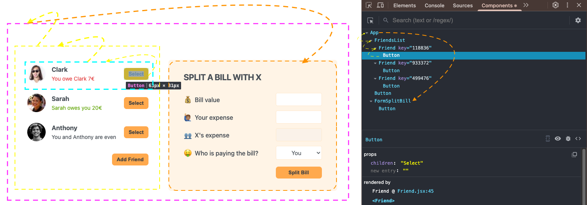

### 1. Add `selectedFriend` useState hook:
```jsx
/* src/App.jsx */
import FriendsList from "./components/FriendsList";
import FormAddFriend from "./components/FormAddFriend";
import Button from "./common/Button";
import FormSplitBill from "./components/FormSplitBill";
import { useState } from "react";

const initialFriends = [
  {
    id: 118836,
    name: "Clark",
    image: "https://i.pravatar.cc/48?u=118836",
    balance: -7,
  },
  {
    id: 933372,
    name: "Sarah",
    image: "https://i.pravatar.cc/48?u=933372",
    balance: 20,
  },
  {
    id: 499476,
    name: "Anthony",
    image: "https://i.pravatar.cc/48?u=499476",
    balance: 0,
  },
];
function App() {
  const [friends, setFriends] = useState(initialFriends);
  const [showAddFriend, setShowAddFriend] = useState(false);
  const [selectedFriend, setSelectedFriend] = useState(null); // 👈🏽 ✅
  const handleShowAddFriend = () => {
    setShowAddFriend(!showAddFriend);
  }; 
  const handleAddFriend = (friend) => {
    setFriends((friends) => [...friends, friend]);
    setShowAddFriend(false);
  };
  return (
    <div className="app">
      <div className="sidebar">
        <FriendsList friends={friends} />
        {showAddFriend && <FormAddFriend onAddFriend={handleAddFriend} />}
        <Button onClick={handleShowAddFriend}>{showAddFriend ? "Close" : "Add Friend"}</Button>
      </div>
      {selectedFriend && <FormSplitBill />}  // 👈🏽 ✅
    </div>
  );
}
export default App;
```
> Try this: `const [selectedFriend, setSelectedFriend] = useState(118836);`


### 2. Create `handleSelection` function doing `prop drilling`:
```jsx
/* src/App.jsx */
import FriendsList from "./components/FriendsList";
import FormAddFriend from "./components/FormAddFriend";
import Button from "./common/Button";
import FormSplitBill from "./components/FormSplitBill";
import { useState } from "react";
const initialFriends = [
  {
    id: 118836,
    name: "Clark",
    image: "https://i.pravatar.cc/48?u=118836",
    balance: -7,
  }
  ...
];
function App() {
  const [friends, setFriends] = useState(initialFriends);
  const [showAddFriend, setShowAddFriend] = useState(false);
  const [selectedFriend, setSelectedFriend] = useState(null);
  const handleShowAddFriend = () => {
    setShowAddFriend(!showAddFriend);
  };
  const handleAddFriend = (friend) => {
    setFriends((friends) => [...friends, friend]);
    setShowAddFriend(false);
  };

  const handleSelection = (friend) => {  // 👈🏽 ✅ (1)
    setSelectedFriend(friend);
  };

  return (
    <div className="app">
      <div className="sidebar">

        <FriendsList friends={friends} onSelection={handleSelection} />  // 👈🏽 ✅ (2)

        {showAddFriend && <FormAddFriend onAddFriend={handleAddFriend} />}
        <Button onClick={handleShowAddFriend}>{showAddFriend ? "Close" : "Add Friend"}</Button>
      </div>
      {selectedFriend && <FormSplitBill />}
    </div>
  );
}
export default App;
```

#### 2.1 Send `onSelection` to `FriendList` component :
```jsx
/* src/components/FriendsList.jsx */
import Friend from "./Friend";
const FriendsList = ({ friends, onSelection }) => {  // 👈🏽 ✅ (1)
  return (
    <ul>
      {friends.map((friend) => (
        <Friend key={friend.id} friend={friend} onSelection={onSelection} />  // 👈🏽 ✅ (2)
      ))}
    </ul>
  );
};

export default FriendsList;
```

#### 2.2 Send `onSelection` to `Friend` component as prop:
```jsx
/* src/components/Friend.jsx */
import Button from "../common/Button";
const Friend = ({ friend, onSelection }) => {  // 👈🏽 ✅ (1)
  return (
    <li>
      
      <h3>{friend.name}</h3>
      {friend.balance < 0 && (
        <p className="red">
          You owe {friend.name} {Math.abs(friend.balance)}€
        </p>
      )}
      {friend.balance > 0 && (
        <p className="green">
          {friend.name} owes you {Math.abs(friend.balance)}€
        </p>
      )}
      {friend.balance === 0 && <p>You and {friend.name} are even</p>}

      <Button onClick={() => onSelection(friend)}>Select</Button>  // 👈🏽 ✅ (1)
    </li>
  );
};
export default Friend;
```

### 3. Send `selectedFriend` to `FormSpiltBill` component as prop:

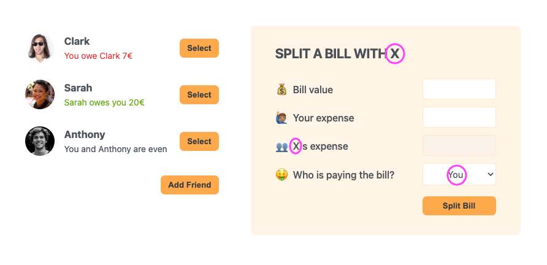

#### 3.1 From `App.jsx`:
```jsx
/* src/App.jsx */
import FriendsList from "./components/FriendsList";
import FormAddFriend from "./components/FormAddFriend";
import Button from "./common/Button";
import FormSplitBill from "./components/FormSplitBill";
import { useState } from "react";
const initialFriends = [
  {
    id: 118836,
    name: "Clark",
    image: "https://i.pravatar.cc/48?u=118836",
    balance: -7,
  },
  ...
];
function App() {
  const [friends, setFriends] = useState(initialFriends);
  const [showAddFriend, setShowAddFriend] = useState(false);
  const [selectedFriend, setSelectedFriend] = useState(null);
  const handleShowAddFriend = () => {
    setShowAddFriend(!showAddFriend);
  };
  const handleAddFriend = (friend) => {
    setFriends((friends) => [...friends, friend]);
    setShowAddFriend(false);
  };
  const handleSelection = (friend) => {
    setSelectedFriend(friend);
  };
  return (
    <div className="app">
      <div className="sidebar">
        <FriendsList friends={friends} onSelection={handleSelection} />
        {showAddFriend && <FormAddFriend onAddFriend={handleAddFriend} />}
        <Button onClick={handleShowAddFriend}>{showAddFriend ? "Close" : "Add Friend"}</Button>
      </div>
      {selectedFriend && <FormSplitBill selectedFriend={selectedFriend} />}  // 👈🏽 ✅  (1)
    </div>
  );
}
export default App;
```

#### 3.2 To `FormSplitBill`:
```jsx
/* src/components/FormSplitBill.jsx */
import Button from "../common/Button";
const FormSplitBill = ({ selectedFriend }) => {  // 👈🏽 ✅  (1)
  return (
    <form className="form-split-bill">
      <h2>Split a bill with {selectedFriend.name}</h2>  // 👈🏽 ✅  (2)

      <label>💰 Bill value</label>
      <input type="text" />

      <label>🙋🏽‍♂️ Your expense</label>
      <input type="text" />

      <label>👥 {selectedFriend.name}'s expense</label>  // 👈🏽 ✅  (3)
      <input type="text" disabled />

      <label>🤑 Who is paying the bill?</label>
      <select>
        <option value="user">You</option>
        <option value="friend">{selectedFriend.name}</option>  // 👈🏽 ✅  (4)
      </select>

      <Button>Split Bill</Button>
    </form>
  );
};
export default FormSplitBill;
```

### 4. Adding the selected Style in `Friend` component:

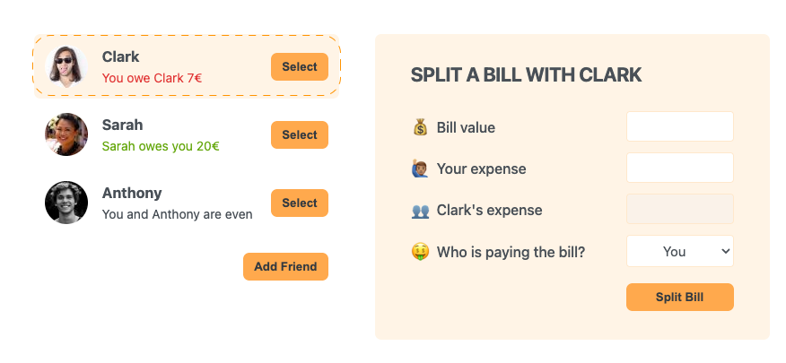


#### 4.1 Sending `selectedFriend` from `App.jsx` to `Friend.jsx` (Prop Drilling)

From `App.jsx`
```jsx
/* src/App.jsx */
import FriendsList from "./components/FriendsList";
import FormAddFriend from "./components/FormAddFriend";
import Button from "./common/Button";
import FormSplitBill from "./components/FormSplitBill";
import { useState } from "react";
const initialFriends = [
  {
    id: 118836,
    name: "Clark",
    image: "https://i.pravatar.cc/48?u=118836",
    balance: -7,
  },
  ...
];
function App() {
  const [friends, setFriends] = useState(initialFriends);
  const [showAddFriend, setShowAddFriend] = useState(false);
  const [selectedFriend, setSelectedFriend] = useState(null);
  const handleShowAddFriend = () => {
    setShowAddFriend(!showAddFriend);
  };
  const handleAddFriend = (friend) => {
    setFriends((friends) => [...friends, friend]);
    setShowAddFriend(false);
  };
  const handleSelection = (friend) => {
    setSelectedFriend(friend);
  };
  return (
    <div className="app">
      <div className="sidebar">
        <FriendsList friends={friends} onSelection={handleSelection} selectedFriend={selectedFriend} />  // 👈🏽 ✅
        {showAddFriend && <FormAddFriend onAddFriend={handleAddFriend} />}
        <Button onClick={handleShowAddFriend}>{showAddFriend ? "Close" : "Add Friend"}</Button>
      </div>
      {selectedFriend && <FormSplitBill selectedFriend={selectedFriend} />}
    </div>
  );
}
export default App;
```

Through `FriendList.jsx`
```jsx
/* src/components/FriendsList.jsx */
import Friend from "./Friend";
const FriendsList = ({ friends, onSelection, selectedFriend }) => {  // 👈🏽 ✅ (1)
  return (
    <ul>
      {friends.map((friend) => (
        <Friend key={friend.id} friend={friend} onSelection={onSelection} selectedFriend={selectedFriend} />  // 👈🏽 ✅ (2)
      ))}
    </ul>
  );
};
export default FriendsList;
```

To `Friend.jsx`
```jsx
/* src/components/Friend.jsx */
import Button from "../common/Button";
const Friend = ({ friend, onSelection, selectedFriend }) => {  // 👈🏽 ✅ (1)
  const isSelected = selectedFriend.id === friend.id;  // 👈🏽 ✅ (2)
  return (
    <li className={isSelected ? "selected" : ""}>  // 👈🏽 ✅ (3)
      
      <h3>{friend.name}</h3>
      {friend.balance < 0 && (
        <p className="red">
          You owe {friend.name} {Math.abs(friend.balance)}€
        </p>
      )}
      {friend.balance > 0 && (
        <p className="green">
          {friend.name} owes you {Math.abs(friend.balance)}€
        </p>
      )}
      {friend.balance === 0 && <p>You and {friend.name} are even</p>}

      <Button onClick={() => onSelection(friend)}>Select</Button>
    </li>
  );
};
export default Friend;
```

### 5. React the Select text in button in `Friend.jsx` component:
```jsx
/* src/components/Friend.jsx */
import Button from "../common/Button";
const Friend = ({ friend, onSelection, selectedFriend }) => {
  const isSelected = selectedFriend?.id === friend.id;
  return (
    <li className={isSelected ? "selected" : ""}>
      
      <h3>{friend.name}</h3>
      {friend.balance < 0 && (
        <p className="red">
          You owe {friend.name} {Math.abs(friend.balance)}€
        </p>
      )}
      {friend.balance > 0 && (
        <p className="green">
          {friend.name} owes you {Math.abs(friend.balance)}€
        </p>
      )}
      {friend.balance === 0 && <p>You and {friend.name} are even</p>}

      <Button onClick={() => onSelection(friend)}>{isSelected ? "Close" : "Select"}</Button>  // 👈🏽 ✅
    </li>
  );
};
export default Friend;
```

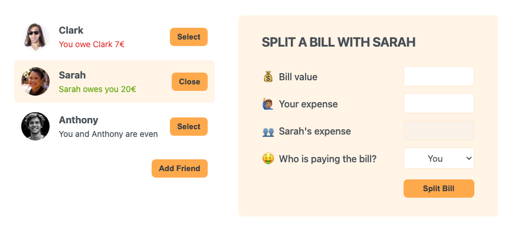


### 6. click again over the `close` button, then the FromSplitBill must be hidden:

> When refresh the app, `FormSplitBill` is hidden because `selectedFriend` is `null` again.

#### 6.1 Comparing `currentSelectedfriend.id === friend.id` in `handleSelection`:
```jsx
/*  */
import FriendsList from "./components/FriendsList";
import FormAddFriend from "./components/FormAddFriend";
import Button from "./common/Button";
import FormSplitBill from "./components/FormSplitBill";
import { useState } from "react";
const initialFriends = [
  {
    id: 118836,
    name: "Clark",
    image: "https://i.pravatar.cc/48?u=118836",
    balance: -7,
  },
  ...
];
function App() {
  const [friends, setFriends] = useState(initialFriends);
  const [showAddFriend, setShowAddFriend] = useState(false);
  const [selectedFriend, setSelectedFriend] = useState(null);
  const handleShowAddFriend = () => {
    setShowAddFriend(!showAddFriend);
  };
  const handleAddFriend = (friend) => {
    setFriends((friends) => [...friends, friend]);
    setShowAddFriend(false);
  };

  const handleSelection = (friend) => {
    //setSelectedFriend(friend);
    setSelectedFriend((current) => (current.id === friend.id ? null : friend));  // 👈🏽 ✅
  };
  return (
    <div className="app">
      <div className="sidebar">
        <FriendsList friends={friends} onSelection={handleSelection} selectedFriend={selectedFriend} />
        {showAddFriend && <FormAddFriend onAddFriend={handleAddFriend} />}
        <Button onClick={handleShowAddFriend}>{showAddFriend ? "Close" : "Add Friend"}</Button>
      </div>
      {selectedFriend && <FormSplitBill selectedFriend={selectedFriend} />}
    </div>
  );
}
export default App;
```
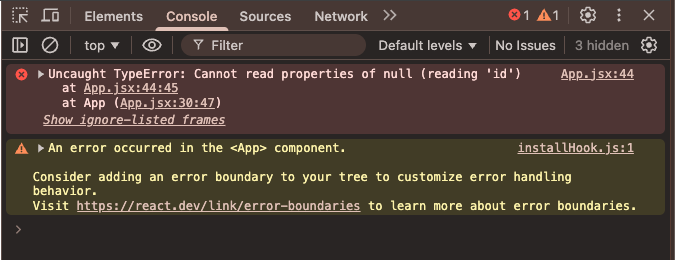


#### 6.2 Fixing this issue:

In `Friend` component:
```jsx
/* src/components/Friend.jsx */
import Button from "../common/Button";
const Friend = ({ friend, onSelection, selectedFriend }) => {
  const isSelected = selectedFriend?.id === friend.id;  // 👈🏽 ✅ 
  // ? is used to check if the selectedFriend is not null
  return (
    <li className={isSelected ? "selected" : ""}>
      
      <h3>{friend.name}</h3>
      {friend.balance < 0 && (
        <p className="red">
          You owe {friend.name} {Math.abs(friend.balance)}€
        </p>
      )}
      {friend.balance > 0 && (
        <p className="green">
          {friend.name} owes you {Math.abs(friend.balance)}€
        </p>
      )}
      {friend.balance === 0 && <p>You and {friend.name} are even</p>}
      <Button onClick={() => onSelection(friend)}>{isSelected ? "Close" : "Select"}</Button>
    </li>
  );
};
export default Friend;
```

In `App.jsx` component:
```jsx
/* src/App.jsx */
import FriendsList from "./components/FriendsList";
import FormAddFriend from "./components/FormAddFriend";
import Button from "./common/Button";
import FormSplitBill from "./components/FormSplitBill";
import { useState } from "react";
const initialFriends = [
  {
    id: 118836,
    name: "Clark",
    image: "https://i.pravatar.cc/48?u=118836",
    balance: -7,
  },
  ...
];
function App() {
  const [friends, setFriends] = useState(initialFriends);
  const [showAddFriend, setShowAddFriend] = useState(false);
  const [selectedFriend, setSelectedFriend] = useState(null);
  const handleShowAddFriend = () => {
    setShowAddFriend(!showAddFriend);
  };
  const handleAddFriend = (friend) => {
    setFriends((friends) => [...friends, friend]);
    setShowAddFriend(false);
  };
  const handleSelection = (friend) => {
    //setSelectedFriend(friend);
    setSelectedFriend((current) => (current?.id === friend.id ? null : friend));  // 👈🏽 ✅
  };
  return (
    <div className="app">
      <div className="sidebar">
        <FriendsList friends={friends} onSelection={handleSelection} selectedFriend={selectedFriend} />
        {showAddFriend && <FormAddFriend onAddFriend={handleAddFriend} />}
        <Button onClick={handleShowAddFriend}>{showAddFriend ? "Close" : "Add Friend"}</Button>
      </div>
      {selectedFriend && <FormSplitBill selectedFriend={selectedFriend} />}
    </div>
  );
}
export default App;
```

### 7. `FormAddFriend` must be closed when `FormSplitBill` is open:

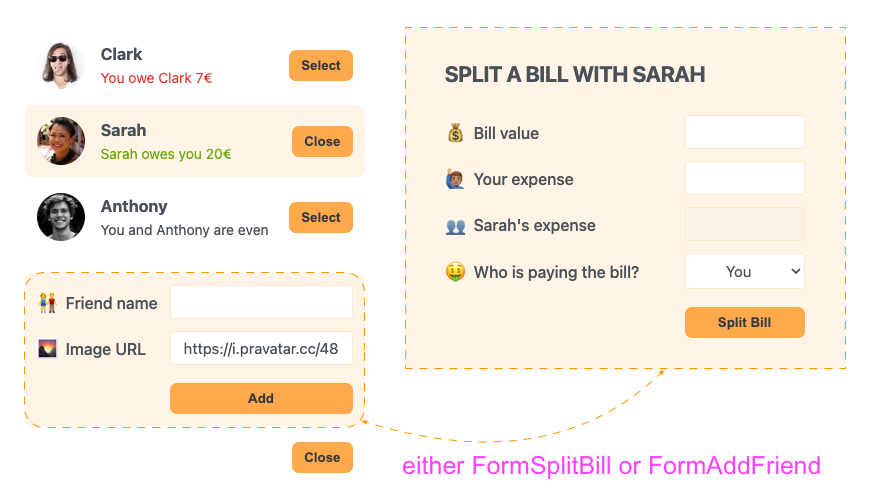

```jsx
/* src/App.jsx */
import FriendsList from "./components/FriendsList";
import FormAddFriend from "./components/FormAddFriend";
import Button from "./common/Button";
import FormSplitBill from "./components/FormSplitBill";
import { useState } from "react";
const initialFriends = [
  {
    id: 118836,
    name: "Clark",
    image: "https://i.pravatar.cc/48?u=118836",
    balance: -7,
  },
  ...
];
function App() {
  const [friends, setFriends] = useState(initialFriends);
  const [showAddFriend, setShowAddFriend] = useState(false);
  const [selectedFriend, setSelectedFriend] = useState(null);
  const handleShowAddFriend = () => {
    setShowAddFriend(!showAddFriend);
  };
  const handleAddFriend = (friend) => {
    setFriends((friends) => [...friends, friend]);
    setShowAddFriend(false);
  };
  const handleSelection = (friend) => {
    setSelectedFriend((current) => (current?.id === friend.id ? null : friend));
    setShowAddFriend(false);  // 👈🏽 ✅
  };
  return (
    <div className="app">
      <div className="sidebar">
        <FriendsList friends={friends} onSelection={handleSelection} selectedFriend={selectedFriend} />
        {showAddFriend && <FormAddFriend onAddFriend={handleAddFriend} />}
        <Button onClick={handleShowAddFriend}>{showAddFriend ? "Close" : "Add Friend"}</Button>
      </div>
      {selectedFriend && <FormSplitBill selectedFriend={selectedFriend} />}
    </div>
  );
}
export default App;
```

## 📚 Lecture 101: Creating Controlled Elements

### 1. Create states for each element in `FormSplitBill`
```jsx
/* src/components/FormSplitBill.jsx */
import Button from "../common/Button";
import { useState } from "react";  // 👈🏽 ✅ (1)
const FormSplitBill = ({ selectedFriend }) => {
  const [bill, setBill] = useState(0);  // 👈🏽 ✅ (1)
  const [paidByUser, setPaidByUser] = useState(0);  // 👈🏽 ✅ (1)
  const [whoIsPaying, setWhoIsPaying] = useState("user");  // 👈🏽 ✅ (1)
  return (
    <form className="form-split-bill">
      <h2>Split a bill with {selectedFriend.name}</h2>
      <label>💰 Bill value</label>
      <input type="text" value={bill} onChange={(e) => setBill(e.target.value)} />  // 👈🏽 ✅ (2)
      <label>🙋🏽‍♂️ Your expense</label>
      <input type="text" value={paidByUser} onChange={(e) => setPaidByUser(e.target.value)} />  // 👈🏽 ✅ (2)
      <label>👥 {selectedFriend.name}'s expense</label>
      <input type="text" disabled />
      <label>🤑 Who is paying the bill?</label>
      <select value={whoIsPaying} onChange={(e) => setWhoIsPaying(e.target.value)}>  // 👈🏽 ✅ (2)
        <option value="user">You</option>
        <option value="friend">{selectedFriend.name}</option>
      </select>
      <Button>Split Bill</Button>
    </form>
  );
};
export default FormSplitBill;
```

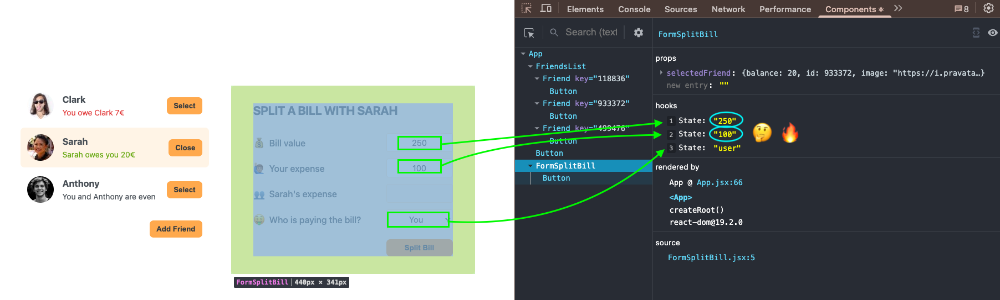

#### 1.1. Value in `bill` and `paidByUser` are _still_ `string` no `numbers`:
```jsx
/*  */
import Button from "../common/Button";
import { useState } from "react";
const FormSplitBill = ({ selectedFriend }) => {
  const [bill, setBill] = useState(0);
  const [paidByUser, setPaidByUser] = useState(0);
  const [whoIsPaying, setWhoIsPaying] = useState("user");
  return (
    <form className="form-split-bill">
      <h2>Split a bill with {selectedFriend.name}</h2>
      <label>💰 Bill value</label>
      <input type="text" value={bill} onChange={(e) => setBill(Number(e.target.value))} />  // 👈🏽 ✅ (2)
      <label>🙋🏽‍♂️ Your expense</label>
      <input type="text" value={paidByUser} onChange={(e) => setPaidByUser(Number(e.target.value))} />  // 👈🏽 ✅ (2)
      <label>👥 {selectedFriend.name}'s expense</label>
      <input type="text" disabled />
      <label>🤑 Who is paying the bill?</label>
      <select value={whoIsPaying} onChange={(e) => setWhoIsPaying(e.target.value)}>
        <option value="user">You</option>
        <option value="friend">{selectedFriend.name}</option>
      </select>
      <Button>Split Bill</Button>
    </form>
  );
};
export default FormSplitBill;
```

#### 1.2. Getting the paidByFriend value:
```jsx
/* src/components/FormSplitBill.jsx */
import Button from "../common/Button";
import { useState } from "react";
const FormSplitBill = ({ selectedFriend }) => {
  const [bill, setBill] = useState("");
  const [paidByUser, setPaidByUser] = useState("");
  let payByFriend = bill ? bill - paidByUser : "";  // 👈🏽 ✅
  const [whoIsPaying, setWhoIsPaying] = useState("user");
  return (
    <form className="form-split-bill">
      <h2>Split a bill with {selectedFriend.name}</h2>
      <label>💰 Bill value</label>
      <input type="text" value={bill} onChange={(e) => setBill(Number(e.target.value))} />
      <label>🙋🏽‍♂️ Your expense</label>
      <input type="text" value={paidByUser} onChange={(e) => setPaidByUser(Number(e.target.value))} />
      <label>👥 {selectedFriend.name}'s expense</label>
      <input type="text" disabled value={payByFriend} />  // 👈🏽 ✅
      <label>🤑 Who is paying the bill?</label>
      <select value={whoIsPaying} onChange={(e) => setWhoIsPaying(e.target.value)}>
        <option value="user">You</option>
        <option value="friend">{selectedFriend.name}</option>
      </select>

      <Button>Split Bill</Button>
    </form>
  );
};
export default FormSplitBill;
```


### 2. input value Validation:
```jsx
/*  */
import Button from "../common/Button";
import { useState } from "react";
const FormSplitBill = ({ selectedFriend }) => {
  const [bill, setBill] = useState("");
  const [paidByUser, setPaidByUser] = useState(0);
  let payByFriend = bill ? bill - paidByUser : "";
  const [whoIsPaying, setWhoIsPaying] = useState("user");
  return (
    <form className="form-split-bill">
      <h2>Split a bill with {selectedFriend.name}</h2>
      <label>💰 Bill value</label>
      <input type="text" value={bill} onChange={(e) => setBill(Number(e.target.value))} />
      <label>🙋🏽‍♂️ Your expense</label>
      <input
        type="text"
        value={paidByUser}
        onChange={(e) => setPaidByUser(Number(e.target.value) > bill ? paidByUser : Number(e.target.value))}  // 👈🏽 ✅
      />
      <label>👥 {selectedFriend.name}'s expense</label>
      <input type="text" disabled value={payByFriend} />
      <label>🤑 Who is paying the bill?</label>
      <select value={whoIsPaying} onChange={(e) => setWhoIsPaying(e.target.value)}>
        <option value="user">You</option>
        <option value="friend">{selectedFriend.name}</option>
      </select>

      <Button>Split Bill</Button>
    </form>
  );
};
export default FormSplitBill;
```

> Explain as:

```js
(new value > bill) ? "keep old value" : "accept new value"
```


> 🔥 Issue:

Click in another friend and `FormSplitBill` keeps their inputs values.


## 📚 Lecture 102: Splitting a Bill
### 1. Adding the `handleSubmit` function in `FormSplitBill`:
```jsx
/* src/components/FormSplitBill.jsx */
import Button from "../common/Button";
import { useState } from "react";
const FormSplitBill = ({ selectedFriend }) => {
  const [bill, setBill] = useState("");
  const [paidByUser, setPaidByUser] = useState(0);
  let payByFriend = bill ? bill - paidByUser : "";
  const [whoIsPaying, setWhoIsPaying] = useState("user");

  const handleSubmit = (e) => {  // 👈🏽 ✅
    //prevent the default behavior of the form
    e.preventDefault();
    //validation: if the bill or paidByUser is empty, return
    if (!bill || !paidByUser) return;
  };

  return (

    <form className="form-split-bill" onSubmit={handleSubmit}>  // 👈🏽 ✅

      <h2>Split a bill with {selectedFriend.name}</h2>
      <label>💰 Bill value</label>
      <input type="text" value={bill} onChange={(e) => setBill(Number(e.target.value))} />
      <label>🙋🏽‍♂️ Your expense</label>
      <input
        type="text"
        value={paidByUser}
        onChange={(e) => setPaidByUser(Number(e.target.value) > bill ? paidByUser : Number(e.target.value))}
      />
      <label>👥 {selectedFriend.name}'s expense</label>
      <input type="text" disabled value={payByFriend} />
      <label>🤑 Who is paying the bill?</label>
      <select value={whoIsPaying} onChange={(e) => setWhoIsPaying(e.target.value)}>
        <option value="user">You</option>
        <option value="friend">{selectedFriend.name}</option>
      </select>
      <Button>Split Bill</Button>
    </form>
  );
};
export default FormSplitBill;
```

### 2. Create a `handleSplitBill` function and send as prop to `FormSplitBill`:
```jsx
/* src/App.jsx */
import FriendsList from "./components/FriendsList";
import FormAddFriend from "./components/FormAddFriend";
import Button from "./common/Button";
import FormSplitBill from "./components/FormSplitBill";
import { useState } from "react";
const initialFriends = [
  {
    id: 118836,
    name: "Clark",
    image: "https://i.pravatar.cc/48?u=118836",
    balance: -7,
  },
  ....
];
function App() {
  const [friends, setFriends] = useState(initialFriends);
  const [showAddFriend, setShowAddFriend] = useState(false);
  const [selectedFriend, setSelectedFriend] = useState(null);

  const handleShowAddFriend = () => {
    setShowAddFriend(!showAddFriend);
  };
  const handleAddFriend = (friend) => {
    setFriends((friends) => [...friends, friend]);
    setShowAddFriend(false);
  };
  const handleSelection = (friend) => {
    setSelectedFriend((current) => (current?.id === friend.id ? null : friend));
    setShowAddFriend(false);
  };

  const handleSplitBIll = (value) => {  // 👈🏽 ✅
    console.log(value);
  };

  return (
    <div className="app">
      <div className="sidebar">
        <FriendsList friends={friends} onSelection={handleSelection} selectedFriend={selectedFriend} />
        {showAddFriend && <FormAddFriend onAddFriend={handleAddFriend} />}
        <Button onClick={handleShowAddFriend}>{showAddFriend ? "Close" : "Add Friend"}</Button>
      </div>

      {selectedFriend && <FormSplitBill selectedFriend={selectedFriend} onSplitBill={handleSplitBIll} />}  // 👈🏽 ✅

    </div>
  );
}
export default App;
```

In `FormSplitBill`:
```jsx
/* src/components/FormSplitBill.jsx */
import Button from "../common/Button";
import { useState } from "react";

const FormSplitBill = ({ selectedFriend, onSplitBill }) => {. // 👈🏽 ✅

  const [bill, setBill] = useState("");
  const [paidByUser, setPaidByUser] = useState(0);
  let paidByFriend = bill ? bill - paidByUser : "";
  const [whoIsPaying, setWhoIsPaying] = useState("user");
  const handleSubmit = (e) => {
    //prevent the default behavior of the form
    e.preventDefault();
    //validation: if the bill or paidByUser is empty, return
    if (!bill || !paidByUser) return;

    onSplitBill(whoIsPaying === "user" ? paidByFriend : -paidByUser);. // 👈🏽 ✅
  };

  return (
    <form className="form-split-bill" onSubmit={handleSubmit}>
      <h2>Split a bill with {selectedFriend.name}</h2>
      <label>💰 Bill value</label>
      <input type="text" value={bill} onChange={(e) => setBill(Number(e.target.value))} />
      <label>🙋🏽‍♂️ Your expense</label>
      <input
        type="text"
        value={paidByUser}
        onChange={(e) => setPaidByUser(Number(e.target.value) > bill ? paidByUser : Number(e.target.value))}
      />
      <label>👥 {selectedFriend.name}'s expense</label>
      <input type="text" disabled value={paidByFriend} />
      <label>🤑 Who is paying the bill?</label>
      <select value={whoIsPaying} onChange={(e) => setWhoIsPaying(e.target.value)}>
        <option value="user">You</option>
        <option value="friend">{selectedFriend.name}</option>
      </select>
      <Button>Split Bill</Button>
    </form>
  );
};
export default FormSplitBill;
```
- When `whoIsPaying === "user"` => `balance: balance + paidByFriend` (positive balance)
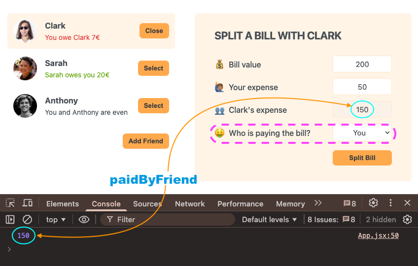

- When `whoIsPaying === "friend"`  => `balance: balance + paidByUser` (negative balance)
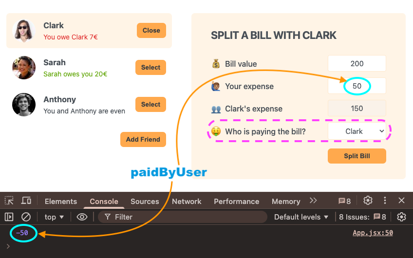

### 3. Complete the `handleSplitBill` function:
```jsx
/* src/App.jsx */
import FriendsList from "./components/FriendsList";
import FormAddFriend from "./components/FormAddFriend";
import Button from "./common/Button";
import FormSplitBill from "./components/FormSplitBill";
import { useState } from "react";
const initialFriends = [
  {
    id: 118836,
    name: "Clark",
    image: "https://i.pravatar.cc/48?u=118836",
    balance: -7,
  },
  ....
];
function App() {
  const [friends, setFriends] = useState(initialFriends);
  const [showAddFriend, setShowAddFriend] = useState(false);
  const [selectedFriend, setSelectedFriend] = useState(null);
  const handleShowAddFriend = () => {
    setShowAddFriend(!showAddFriend);
  };
  const handleAddFriend = (friend) => {
    setFriends((friends) => [...friends, friend]);
    setShowAddFriend(false);
  };
  const handleSelection = (friend) => {
    setSelectedFriend((current) => (current?.id === friend.id ? null : friend));
    setShowAddFriend(false);
  };
  const handleSplitBill = (value) => {
    console.log(value);

    //no mutate the friends array, better create a new array with friends and the friend data updated inside it.
    setFriends((friends) =>
      friends.map((friend) => (
        friend.id === selectedFriend.id 
        ? { ...friend, balance: friend.balance + value } 
        : friend
      ))
    );  // 👈🏽 ✅

    //reset the selected friend
    setSelectedFriend(null);  // 👈🏽 ✅

  };
  return (
    <div className="app">
      <div className="sidebar">
        <FriendsList friends={friends} onSelection={handleSelection} selectedFriend={selectedFriend} />
        {showAddFriend && <FormAddFriend onAddFriend={handleAddFriend} />}
        <Button onClick={handleShowAddFriend}>{showAddFriend ? "Close" : "Add Friend"}</Button>
      </div>
      {selectedFriend && <FormSplitBill selectedFriend={selectedFriend} onSplitBill={handleSplitBill} />}
    </div>
  );
}
export default App;
```

---

<br>

# 🧑🏾‍💻 Section 11: How react Works behind the Scenes

<br>

## 🔧 01. Lesson 133 — _Using the Key prop to fix our Eat-'N-Split app_

### 🧠 01.1 Context:

In React, the `key` prop is primarily used to help React identify elements between renders during the reconciliation process. Most commonly, we pass `key` when rendering lists (e.g. `friends.map(...)`) so React can:

- Keep the correct element/component instance associated with the correct data item.
- Reorder/insert/remove items efficiently without accidentally reusing the wrong DOM or component state.

However, `key` can also be used intentionally to **force React to recreate (remount) a component** when some “identity” changes. This is useful when a component has **local state** (`useState`) that should be reset when the underlying “entity” changes.

#### Why this matters in Eat-'N-Split

`FormSplitBill` manages local state for the inputs:
- `bill`
- `paidByUser`
- `whoIsPaying`

When you select a different friend, the component receives a different `selectedFriend` prop, but **React can reuse the same component instance**, meaning the `useState` values can persist and the inputs remain filled. This is a UX bug because you end up seeing the previous friend’s bill values.

By rendering `FormSplitBill` with a stable `key` tied to the selected friend id (e.g. `key={selectedFriend.id}`), React treats it as a **different component instance per friend**, so it gets unmounted/mounted and all local state resets to the initial values.

#### Pros / Cons

- **Pros**:
  - Very simple and explicit reset behavior.
  - Avoids extra effect logic (`useEffect`) just to reset inputs.
  - Keeps form state encapsulated in the form component.
- **Cons**:
  - Remounting resets *all* local state (including focus, touched/dirty state, etc.).
  - If the component had expensive initialization, remounting could be undesirable.

#### Alternatives to consider

- Reset form state in `FormSplitBill` when `selectedFriend` changes using `useEffect`.
- Lift the form state up to `App` so the parent fully controls the form inputs (more verbose, but explicit).
- Use a reducer (`useReducer`) and dispatch a `RESET` action on friend changes (good for more complex forms).

### ⚙️ 01.2 Updating code according the context:

#### 01.2.1 Adding `selectedFriend.id` as `key` in `FormSplitBill`:

According what we see in section  11 - Lecture 132 for `How-react-works` project with each tab in order to get the `TabContent` for each tab:

```jsx
/* src/App.jsx */
import FriendsList from "./components/FriendsList";
import FormAddFriend from "./components/FormAddFriend";
import Button from "./common/Button";
import FormSplitBill from "./components/FormSplitBill";
import { useState } from "react";
const initialFriends = [
  {
    id: 118836,
    name: "Clark",
    image: "https://i.pravatar.cc/48?u=118836",
    balance: -7,
  },
  {
    id: 933372,
    name: "Sarah",
    image: "https://i.pravatar.cc/48?u=933372",
    balance: 20,
  },
  {
    id: 499476,
    name: "Anthony",
    image: "https://i.pravatar.cc/48?u=499476",
    balance: 0,
  },
];
function App() {
  const [friends, setFriends] = useState(initialFriends);
  const [showAddFriend, setShowAddFriend] = useState(false);
  const [selectedFriend, setSelectedFriend] = useState(null);
  const handleShowAddFriend = () => {
    setShowAddFriend(!showAddFriend);
  };
  const handleAddFriend = (friend) => {
    setFriends((friends) => [...friends, friend]);
    setShowAddFriend(false);
  };
  const handleSelection = (friend) => {
    setSelectedFriend((current) => (current?.id === friend.id ? null : friend));
    setShowAddFriend(false);
  };
  const handleSplitBill = (value) => {
    console.log(value);
    //no mutate the friends array, better create a new array with friends and new friend inside it.
    setFriends((friends) =>
      friends.map((friend) => (friend.id === selectedFriend.id ? { ...friend, balance: friend.balance + value } : friend))
    );
    //reset the selected friend
    setSelectedFriend(null);
  };
  return (
    <div className="app">
      <div className="sidebar">
        <FriendsList friends={friends} onSelection={handleSelection} selectedFriend={selectedFriend} />
        {showAddFriend && <FormAddFriend onAddFriend={handleAddFriend} />}
        <Button onClick={handleShowAddFriend}>{showAddFriend ? "Close" : "Add Friend"}</Button>
      </div>
      {selectedFriend && (
        <FormSplitBill 
          selectedFriend={selectedFriend} 
          onSplitBill={handleSplitBill} 
          key={selectedFriend.id}   {/* 👈🏽 ✅ */}
        />   
      )}
    </div>
  );
}
export default App;
```

- First split a bill with `Clark` and fill all data:
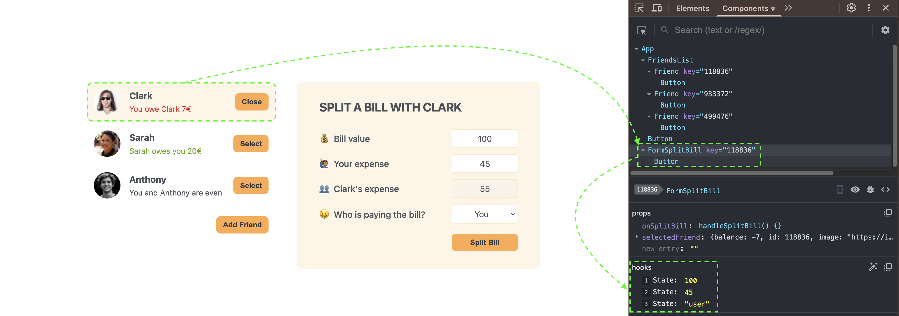

- Then click on `Anthony` and verify the Split a bill form is empty:
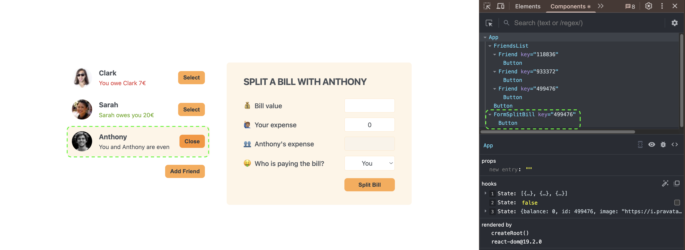

### 🐞 01.3 Issues:

- **Form inputs persist when switching friends (before using `key`)**: `FormSplitBill` has local state for inputs, and when `selectedFriend` changes React may reuse the same component instance, causing previously entered values to remain visible (UX bug).

| Issue | Status | Log/Error |
| ----- | ------ | --------- |
| `FormSplitBill` keeps previous input values when selecting another friend | ✅ Fixed | No runtime error. Repro: fill inputs for Friend A, then select Friend B → inputs still filled. Fix: render `FormSplitBill` with `key={selectedFriend.id}` in `src/App.jsx` (see `src/App.jsx` L64-L66). |

### 🧱 01.4 Pending Fixes (TODO)

- [ ] Verify regression manually: select Friend A, type values in `FormSplitBill`, then select Friend B and confirm the form is reset (file: `src/App.jsx`, around `FormSplitBill` render, L64-L66).
- [ ] Document the invariant: keep `key` stable + unique per friend (do not use array index). Location: `src/App.jsx` L65.


<br>

## 🔧 02. Lesson 134 — _Rules for Render Logic: Pure Component_

### 🧠 02.1 Context:

In React, a component should behave like a **pure function** with respect to its **render logic**:

- Same **inputs** (props, state, context) → same **output** (JSX/UI).
- The render phase must be **predictable** and **free of side effects**.

This matters because React may render components **multiple times** (and sometimes in ways you don’t expect) in order to:
- Reconcile UI changes efficiently
- Prepare for concurrent rendering features
- Keep the UI consistent while state updates happen

If render logic is not pure, you can get bugs that are hard to reproduce (double requests, duplicated logs, random UI changes, or state getting out of sync).

#### The two types of logic (and where side effects are allowed)

React components usually contain:

1. **Render logic** (must be pure): everything that runs while React is computing JSX.
2. **Event handlers** (side effects allowed): code triggered by user interaction or events.

In this project:
- **Pure render logic examples**:
  - `Friend` renders conditional UI based on `friend.balance` (pure computation like `Math.abs(...)`) (`src/components/Friend.jsx`).
  - `FormSplitBill` derives `paidByFriend` from `bill` and `paidByUser` (derived values are OK) (`src/components/FormSplitBill.jsx`).
- **Side effects kept out of render** (good):
  - `crypto.randomUUID()` is used inside `handleSubmit` (event handler) in `FormAddFriend`, not during render (`src/components/FormAddFriend.jsx` L7-L30).
  - `console.log(value)` is inside `handleSplitBill` (event handler) in `App` (`src/App.jsx` L46-L55).

#### Rules of thumb for “pure render logic”

- **Do not mutate** props/state/variables that are shared across renders.
  - Bad: `friends.push(...)` in render; Good: create new arrays/objects in event handlers (`setFriends(prev => [...prev, newFriend])`).
- **Do not perform side effects** during render:
  - No network calls, no subscriptions, no timers, no DOM manipulation, no writing to storage, no global mutations.
- **Do not use non-deterministic values** during render:
  - Avoid `Math.random()`, `Date.now()`, `crypto.randomUUID()` in render output.
  - If you need them, generate them in an event handler or in an effect, then store in state.
- **Derived data is fine**:
  - Computing values from props/state (like `paidByFriend` or `Math.abs(balance)`) is pure and recommended.

#### Advantages / Disadvantages

- **Pros**:
  - Predictable UI; easier debugging
  - Works correctly with React’s rendering behavior (including re-renders and potential double-invocations in dev)
  - Safer refactors and future React features
- **Cons**:
  - Requires discipline: move side effects to event handlers or effects
  - Sometimes feels “indirect” (compute first, then render) but pays off long-term

#### Alternatives / when to do something else

- If you need side effects based on props/state changes, use **effects** (`useEffect`) instead of render logic.
- If you need to compute expensive derived data, consider memoization (`useMemo`) — still pure, but used for performance only when needed.

### ⚙️ 02.2 Updating code according the context:

#### 02.2.1 The **Two Types** of logic in React components:

1. Render logic
2. Event Handler Functions

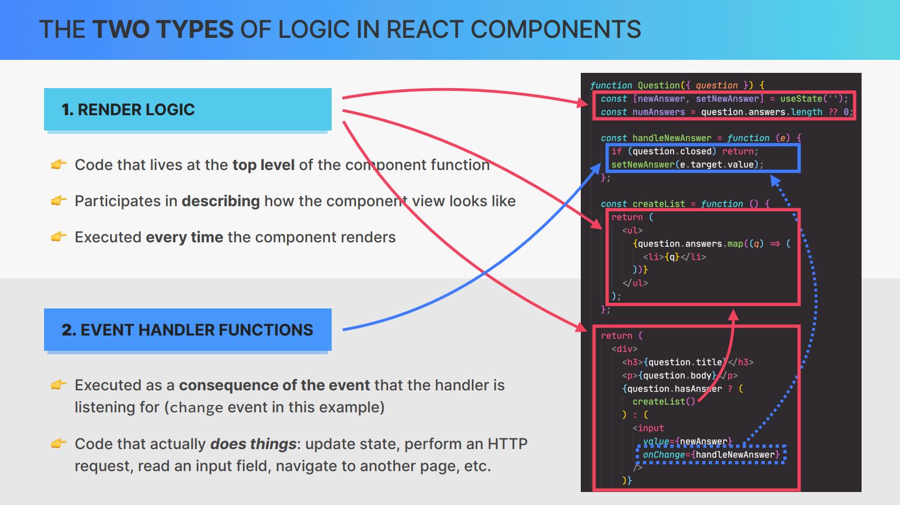

#### 02.2.2 **Refresher**: functional programming principles
1. side effect
2. Pure functions

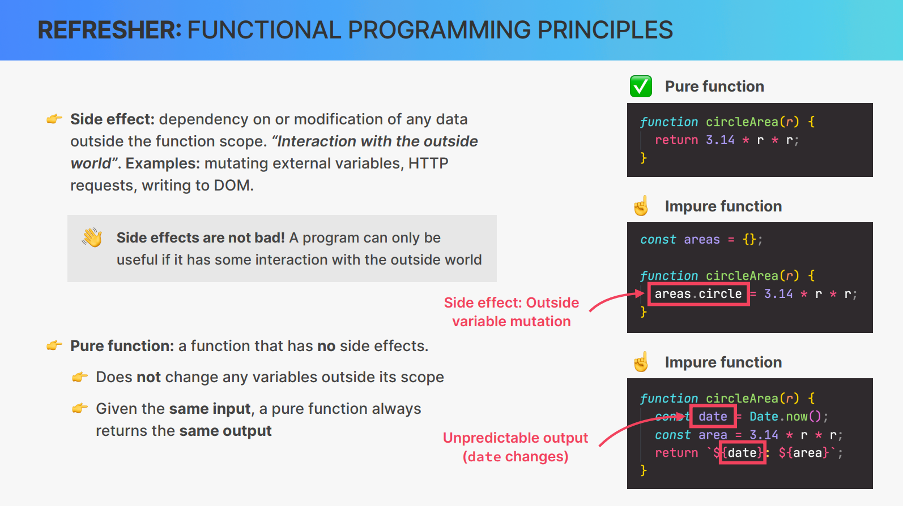

#### 02.2.3 **Rules** for render logic:
1. components must be pure when it comes to render logic.
2. Render logic must produce no side effects.

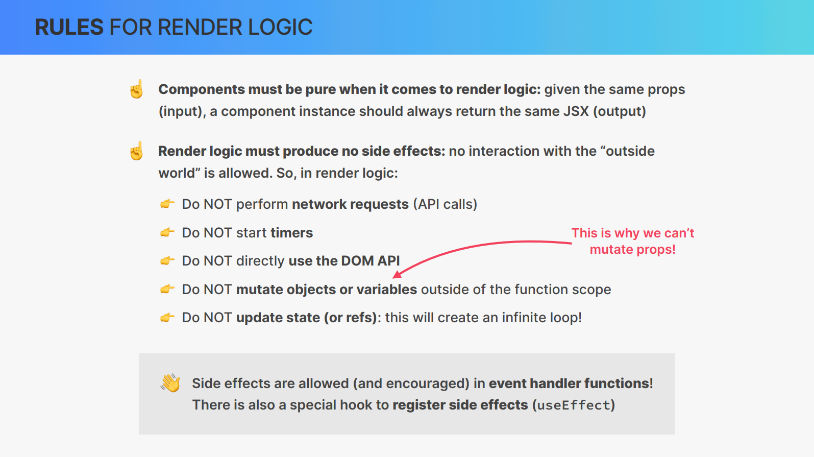

### 🐞 02.3 Issues:

- **No render-phase side effects detected in current implementation**: current components do not perform I/O (fetch/storage/DOM mutations) during render; side-effectful code is confined to event handlers (good).

| Issue | Status | Log/Error |
| ----- | ------ | --------- |
| Render logic is pure (no side effects in render) | ℹ️ OK | Checked `src/App.jsx`, `src/components/Friend.jsx`, `src/components/FormSplitBill.jsx`, `src/components/FormAddFriend.jsx`. Side effects found (`crypto.randomUUID()`, `console.log`) occur inside handlers, not during render. |
| Debug logging in event handlers | ℹ️ Low Priority | `console.log(value)` in `src/App.jsx` L47 can be noisy in production; it’s not a render purity bug, but consider removing before shipping. |

### 🧱 02.4 Pending Fixes (TODO)

- [ ] Remove debug `console.log(value)` from `handleSplitBill` in `src/App.jsx` (around L46-L55) before production release.
- [ ] Add a short code-review guideline note: “No side effects in render logic; use event handlers or `useEffect`” (applies to `src/App.jsx`, `src/components/*`).
- [ ] (Optional) Add ESLint configuration to warn on `console.log` in production builds (file: `eslint.config.js`).


---

🔥 🔥 🔥

<br>

## 🔧 XX. Lesson YYY — _{{TITLE_NAME}}_

### 🧠 XX.1 Context:

### ⚙️ XX.2 Updating code according the context:

#### XX.2.1

```tsx
/*  */
```

#### XX.2.2

```tsx
/*  */
```

### 🐞 XX.3 Issues:

- **first issue**: something..

| Issue | Status | Log/Error |
| ----- | ------ | --------- |

### 🧱 XX.4 Pending Fixes (TODO)

- [ ]

