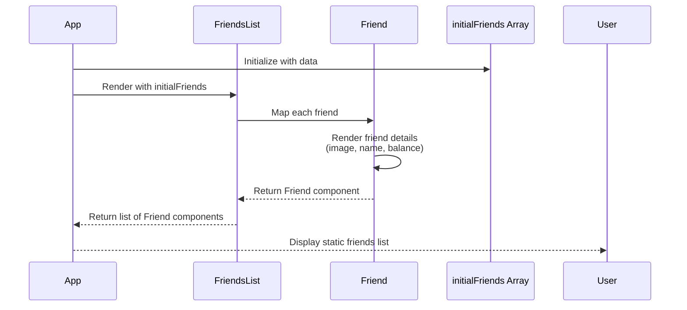

# Lecture 096: Building the Static App: List of Friends

## Overview
This lecture focuses on building the static structure of the application, creating the initial component hierarchy for displaying a list of friends.

## Sequence Diagram



## Component Hierarchy

```
App
└── FriendsList
    └── Friend (multiple instances)
```

## Key Concepts

- **Component Composition**: Building complex UIs by composing smaller components
- **Props**: Passing data from parent to child components
- **Static Rendering**: Displaying data without interactivity
- **List Rendering**: Using `.map()` to render multiple components

## Data Flow

1. `App` component initializes with `initialFriends` array
2. `App` passes `friends` array to `FriendsList` component
3. `FriendsList` maps over the array and renders a `Friend` component for each item
4. Each `Friend` component receives a `friend` object as a prop and displays the friend's information


