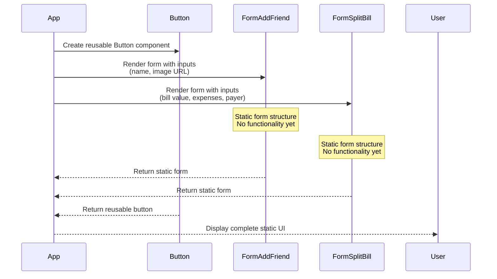

# Lecture 097: Building the Static App: Forms

## Overview
This lecture focuses on creating static form components (`FormAddFriend` and `FormSplitBill`) and a reusable `Button` component.

## Sequence Diagram



## Component Structure

```
App
├── FriendsList
│   └── Friend (multiple)
├── FormAddFriend
│   └── Button
├── Button (Add Friend)
└── FormSplitBill
    └── Button
```

## Key Concepts

- **Reusable Components**: Creating a `Button` component that can be used throughout the app
- **Form Structure**: Setting up form layouts with labels and inputs
- **Component Organization**: Separating forms into their own components
- **Static UI**: Building the visual structure before adding functionality

## Components Created

1. **Button Component**: Reusable button component accepting `children` prop
2. **FormAddFriend Component**: Form for adding a new friend with name and image URL inputs
3. **FormSplitBill Component**: Form for splitting a bill with bill value, expenses, and payer selection


