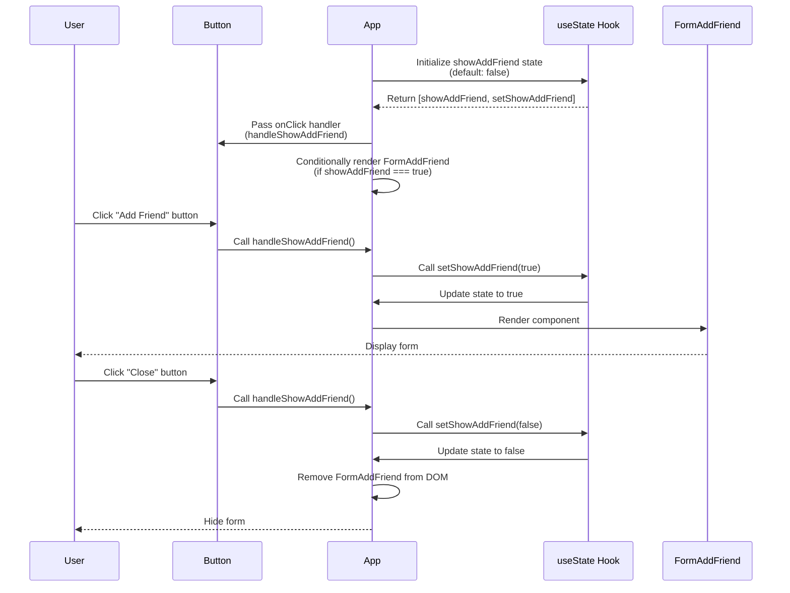

# Lecture 098: Displaying the New Friend Form

## Overview
This lecture focuses on implementing state management to toggle the visibility of the `FormAddFriend` component using React's `useState` hook.

## Sequence Diagram



## State Management Flow

```
App Component State:
└── showAddFriend: boolean
    ├── false: FormAddFriend hidden
    └── true: FormAddFriend visible
```

## Key Concepts

- **State Management**: Using `useState` hook to manage component state
- **Conditional Rendering**: Showing/hiding components based on state
- **Event Handlers**: Creating functions to handle user interactions
- **Props Drilling**: Passing event handlers from parent to child components

## Implementation Steps

1. Add `useState` hook to `App` component
2. Create `showAddFriend` state variable
3. Create `handleShowAddFriend` function to toggle state
4. Pass `onClick` handler to `Button` component
5. Conditionally render `FormAddFriend` based on state
6. Update button text based on state ("Add Friend" / "Close")


