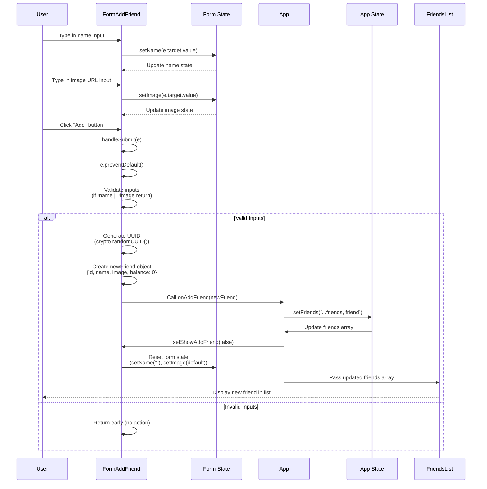

# Lecture 099: Adding a New Friend

## Overview
This lecture focuses on implementing the functionality to add a new friend to the list, including form state management, validation, and lifting state up to the parent component.

## Sequence Diagram



## State Lifting Process

```
Before (Local State):
FormAddFriend
└── name, image (local state)

After (Lifted State):
App
└── friends (state)
    └── FriendsList (receives as prop)
        └── Friend components

FormAddFriend
└── name, image (local state)
    └── onAddFriend callback (prop)
```

## Key Concepts

- **Controlled Components**: Form inputs controlled by React state
- **Form Validation**: Checking if inputs are filled before submission
- **State Lifting**: Moving state from child to parent component
- **Immutable Updates**: Creating new arrays instead of mutating existing ones
- **Callback Props**: Passing functions from parent to child to update parent state

## Implementation Steps

1. Add local state (`name`, `image`) to `FormAddFriend`
2. Create controlled inputs with `value` and `onChange`
3. Implement `handleSubmit` function with validation
4. Move `initialFriends` from `FriendsList` to `App`
5. Create `friends` state in `App` component
6. Create `handleAddFriend` function in `App`
7. Pass `onAddFriend` prop to `FormAddFriend`
8. Update `friends` state when new friend is added
9. Close form after successful submission


