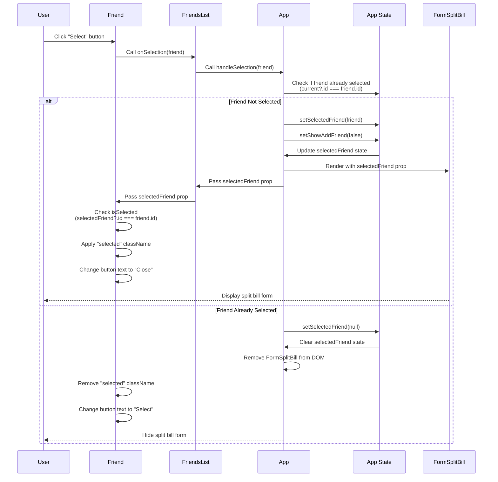

# Lecture 100: Selecting a Friend

## Overview
This lecture focuses on implementing the functionality to select a friend, display the split bill form, and manage the selected state throughout the component hierarchy.

## Sequence Diagram



## State Management Flow

```
App Component State:
├── friends: Array
├── showAddFriend: boolean
└── selectedFriend: Object | null
    ├── null: No friend selected
    └── friend object: Friend selected
        └── FormSplitBill rendered
```

## Prop Drilling Path

```
App
├── selectedFriend (state)
└── handleSelection (function)
    └── FriendsList
        ├── selectedFriend (prop)
        └── onSelection (prop)
            └── Friend
                ├── selectedFriend (prop)
                └── onSelection (prop)
                    └── Button onClick
```

## Key Concepts

- **Selection State**: Managing which friend is currently selected
- **Conditional Rendering**: Showing `FormSplitBill` only when a friend is selected
- **Prop Drilling**: Passing `selectedFriend` and `onSelection` through multiple component levels
- **Toggle Selection**: Selecting/deselecting the same friend
- **Visual Feedback**: Applying selected styles and changing button text
- **Form Closure**: Closing `FormAddFriend` when selecting a friend

## Implementation Steps

1. Add `selectedFriend` state to `App` component
2. Create `handleSelection` function with toggle logic
3. Pass `onSelection` prop through `FriendsList` to `Friend`
4. Pass `selectedFriend` prop through `FriendsList` to `Friend`
5. Implement selection logic in `Friend` component
6. Apply conditional styling based on selection
7. Update button text based on selection state
8. Pass `selectedFriend` to `FormSplitBill` component
9. Display friend's name in `FormSplitBill`
10. Close `FormAddFriend` when selecting a friend


