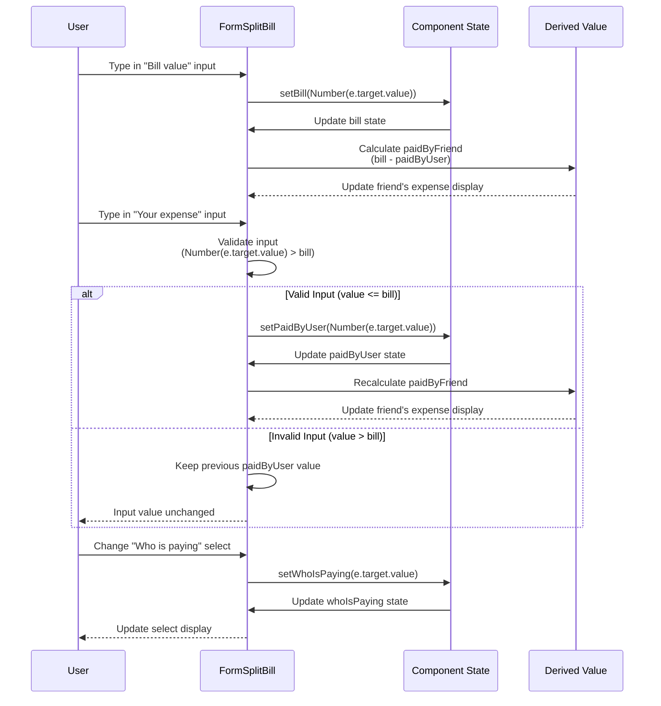

# Lecture 101: Creating Controlled Elements

## Overview
This lecture focuses on converting form inputs in `FormSplitBill` into controlled components, managing their state, and implementing derived values and input validation.

## Sequence Diagram



## State Management Structure

```
FormSplitBill Component State:
├── bill: number (controlled input)
├── paidByUser: number (controlled input)
├── whoIsPaying: "user" | "friend" (controlled select)
└── paidByFriend: number (derived value)
    └── Calculated as: bill - paidByUser
```

## Controlled Elements Flow

```
User Input → onChange Handler → State Update → Re-render → Updated Display
```

## Key Concepts

- **Controlled Components**: Form inputs whose values are controlled by React state
- **Type Conversion**: Converting string inputs to numbers using `Number()`
- **Derived Values**: Calculating values based on other state values
- **Input Validation**: Preventing invalid input values (e.g., expense > bill)
- **State Synchronization**: Keeping form state in sync with user input

## Implementation Steps

1. Add `useState` hook to `FormSplitBill` component
2. Create state variables: `bill`, `paidByUser`, `whoIsPaying`
3. Convert inputs to controlled components with `value` and `onChange`
4. Implement type conversion for numeric inputs
5. Calculate `paidByFriend` as a derived value
6. Display `paidByFriend` in disabled input
7. Implement validation for `paidByUser` (cannot exceed bill)
8. Handle edge cases (empty inputs, type conversion)

## Validation Logic

```javascript
// Validation: paidByUser cannot exceed bill
onChange={(e) => 
  setPaidByUser(
    Number(e.target.value) > bill 
      ? paidByUser  // Keep old value if invalid
      : Number(e.target.value)  // Accept new value if valid
  )
}
```


