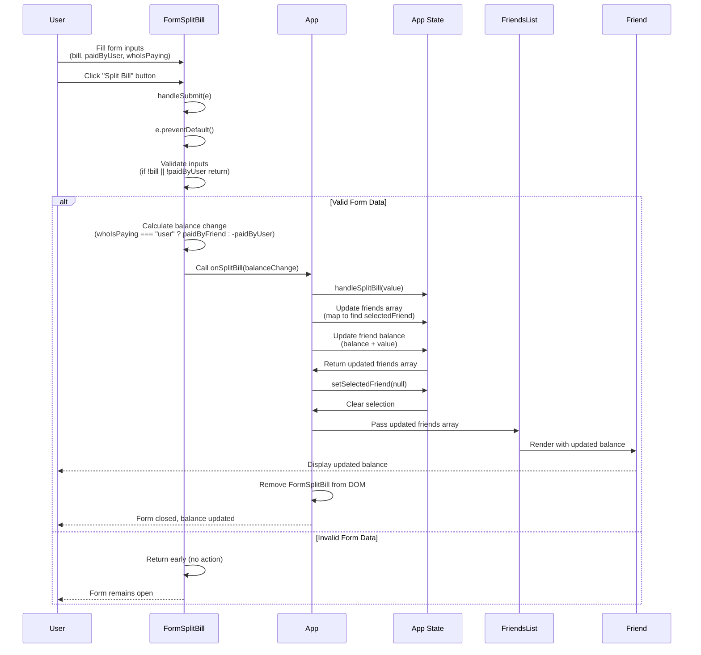

# Lecture 102: Splitting a Bill

## Overview
This lecture focuses on implementing the final functionality to split a bill, calculate the balance change, and update the friend's balance in the friends list.

## Sequence Diagram



## Balance Calculation Logic

```
When whoIsPaying === "user":
  balanceChange = paidByFriend (positive)
  → Friend owes you money

When whoIsPaying === "friend":
  balanceChange = -paidByUser (negative)
  → You owe friend money
```

## State Update Flow

```
FormSplitBill
└── onSplitBill(balanceChange)
    └── App.handleSplitBill(value)
        ├── Update friends array (immutable)
        │   └── Map through friends
        │       └── If friend.id === selectedFriend.id
        │           └── Update balance: balance + value
        └── Clear selection
            └── setSelectedFriend(null)
```

## Key Concepts

- **Form Submission**: Handling form submit events with validation
- **Balance Calculation**: Computing balance changes based on who pays
- **Immutable State Updates**: Using `.map()` to update array state
- **State Synchronization**: Updating parent state from child component
- **Form Reset**: Clearing selection after successful submission
- **Conditional Logic**: Different calculations based on payer selection

## Implementation Steps

1. Add `handleSubmit` function to `FormSplitBill`
2. Implement form validation
3. Calculate balance change based on `whoIsPaying`
4. Create `handleSplitBill` function in `App` component
5. Pass `onSplitBill` prop to `FormSplitBill`
6. Update friends array immutably using `.map()`
7. Update selected friend's balance
8. Clear `selectedFriend` state after update
9. Close `FormSplitBill` form automatically

## Balance Update Logic

```javascript
// Positive balance: Friend owes you
if (whoIsPaying === "user") {
  balanceChange = paidByFriend;  // e.g., +15€
}

// Negative balance: You owe friend
if (whoIsPaying === "friend") {
  balanceChange = -paidByUser;  // e.g., -20€
}

// Update friend's balance
friend.balance = friend.balance + balanceChange
```


